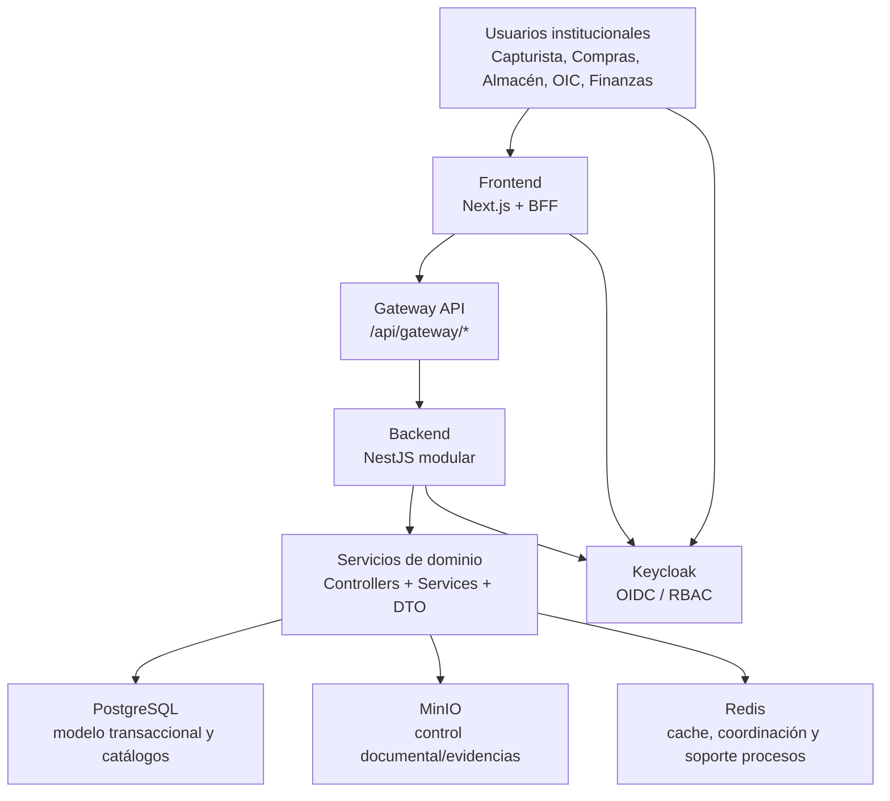
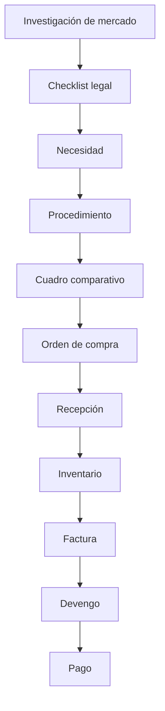

# SYSTEM_ARCHITECTURE_v1.11

**Sistema:** ERP Gubernamental de Abastecimiento  
**Versión de referencia:** v1.11.0  
**Fecha:** 2026-03-06  
**Repositorios:**
- `erp-gob-abastecimiento` (backend)
- `erp-gob-frontend` (frontend)
- `erp-gob-suite` (suite docker reproducible)

**Fuente contractual principal:** `erp-gob-abastecimiento/docs/contracts/openapi_v1.11.0_draft.json`

---

## 1. Arquitectura General Del Sistema

### 1.1 Propósito
El ERP de Abastecimiento institucionaliza el ciclo de compra pública desde la planeación y validación legal hasta la ejecución operativa y financiera, con trazabilidad auditable y controles de riesgo.

### 1.2 Problema institucional que resuelve
- Fragmentación de procesos entre áreas de compras, almacén, financiero y OIC.
- Baja trazabilidad documental/jurídica de decisiones y secuencias.
- Dificultad para detectar desviaciones operativas antes de impactos presupuestales.

### 1.3 Alcance funcional actual (v1.11)
- Flujo contractual operativo completo.
- Flujo financiero operativo (Factura -> Devengo -> Pago).
- Observabilidad institucional (timeline, riesgos, alertas, dashboard).
- Gestión de proveedor + compliance y scoring.
- Inventario operativo y analítico.

### 1.4 Diagrama conceptual


### 1.5 Rol de componentes clave
- **Keycloak:** autenticación OIDC, emisión de tokens y base de RBAC.
- **MinIO:** almacenamiento de evidencia/documentos con URLs firmadas.
- **Redis:** soporte de performance/estado efímero y componentes de ejecución.
- **PostgreSQL:** persistencia transaccional y read models institucionales.

---

## 2. Dominios Del ERP

> Nota: los endpoints listados se basan en controladores backend existentes y contrato v1.11 draft (incremental).

| Dominio | Propósito | Entidades principales (Prisma) | Endpoints HTTP clave | Relación principal |
|---|---|---|---|---|
| Expedientes | Contenedor rector del proceso de compra | `Expediente`, `ExpedienteCierreChecklist` | `POST /expedientes`, `GET /expedientes/{id}`, `PATCH /expedientes/{id}/estado`, `POST /expedientes/{id}/cerrar`, `GET /expedientes/{id}/timeline` | Núcleo de Necesidad, Procedimiento, Orden, Recepción, Finanzas y Observabilidad |
| Necesidades | Registrar requerimientos por expediente | `Necesidad` | `POST /expedientes/{expedienteId}/necesidades`, `GET /expedientes/{expedienteId}/necesidades`, `GET /necesidades/{id}` | Entrada para investigación y procedimiento |
| Investigación de mercado | Sustento técnico-económico pre-procedimiento | `InvestigacionMercado`, `Cotizacion` | `POST /investigacion-mercado`, `GET /expedientes/{expedienteId}/investigacion-mercado`, `GET /investigacion-mercado/{id}`, `PATCH /investigacion-mercado/{id}` | Alimenta checklist legal y reglas de riesgo |
| Checklist legal | Validación de cumplimiento procedimental | `ExpedienteCierreChecklist` + bitácora legal | `GET /expedientes/{id}/checklist`, `PATCH /expedientes/{id}/checklist`, `GET /procedimientos/{id}/checklist-legal`, `POST /procedimientos/{id}/checklist-legal` | Gating jurídico para orden/procedimiento |
| Procedimientos | Gestión del proceso de contratación | `Procedimiento` | `POST /expedientes/{expedienteId}/procedimientos`, `GET /procedimientos/{id}`, `PATCH /procedimientos/{id}/estado` | Recibe insumos de necesidad/legal e integra cuadro |
| Eventos jurídicos | Trazabilidad legal del procedimiento | eventos sobre procedimiento (bitácora/eventos) | `POST /procedimientos/{id}/eventos`, `GET /procedimientos/{id}/eventos`, `GET /procedimiento-eventos/{id}` | Alimenta timeline y observabilidad |
| Cuadro comparativo | Evaluación comparativa de propuestas | `CuadroComparativo`, `CuadroComparativoDetalle`, `CuadroComparativoRenglon`, `Oferta` | `GET /cuadros`, `GET /cuadros/{id}`, `GET /cuadros/{id}/renglones`, `GET /cuadros/{id}/detalles` | Base para adjudicación y orden |
| Orden de compra | Formalización de adjudicación | `OrdenCompra`, `OrdenCompraRenglon` | `POST /ordenes`, `GET /ordenes`, `GET /ordenes/{id}`, `PATCH /ordenes/{id}/estado` | Precede recepción e inicia cadena financiera |
| Recepción | Registro de recepción física/documental | `Recepcion`, `RecepcionDetalle` | `POST /recepciones`, `GET /recepciones`, `GET /recepciones/{id}`, `PATCH /recepciones/{id}/estado` | Impacta inventario y validación secuencial |
| Inventario | Control de existencias y movimientos | `Inventario`, `Kardex`, `ConteoFisico`, `AjusteInventario` | `POST /inventory/ajustes`, `GET /inventory/ajustes/{id}`, `POST /inventory/conteos`, `GET /inventory/conteos`, `GET /inventory/conteos/{id}`, `PATCH /inventory/conteos/{id}/cerrar` | Recibe impacto de recepción y alimenta observabilidad |
| Productos | Catálogo maestro de bienes/servicios | `Producto`, `Variante` | `POST /productos`, `GET /productos`, `GET /productos/{id}`, `PATCH /productos/{id}`, `PATCH /productos/{id}/estado` | Referencia para necesidades e inventario |
| Proveedores | Catálogo maestro de proveedores | `Proveedor` | `POST /proveedores`, `GET /proveedores`, `GET /proveedores/{id}`, `PATCH /proveedores/{id}`, `PATCH /proveedores/{id}/estado` | Relación contractual y financiera |
| Proveedor compliance | Due diligence y control de riesgo proveedor | `ProveedorPersonaRelacion`, `ProveedorDomicilio`, `ProveedorPadron`, `ProveedorDeclaracionFormal` | `GET/POST/PATCH /proveedores/{id}/contactos*`, `GET/POST/PATCH /proveedores/{id}/domicilios*`, `GET /proveedores/{id}/padron`, `GET /proveedores/{id}/declaraciones` | Soporta evaluación de riesgos y cumplimiento |
| Facturación | Registro y estado de factura contractual | `Factura` | `POST /facturas`, `GET /facturas/{id}`, `GET /contratos/{id}/facturas`, `PATCH /facturas/{id}` | Paso financiero posterior a orden/recepción |
| Devengo | Reconocimiento financiero de obligación | `Devengo` | `POST /facturas/{id}/devengo`, `GET /devengos/{id}`, `GET /contratos/{id}/devengos` | Paso intermedio entre factura y pago |
| Pago | Registro de pago ejecutado | `Pago` | `POST /devengos/{id}/pago`, `GET /pagos/{id}`, `GET /contratos/{id}/pagos` | Cierre financiero del expediente/contrato |
| Observabilidad | Control institucional de secuencia y riesgo | proyecciones desde `Expediente`, `OrdenCompra`, `Recepcion`, `Kardex`, `Bitacora`, etc. | `GET /observabilidad/expedientes/{id}/timeline`, `GET /observabilidad/expedientes/{id}/riesgos`, `GET /observabilidad/alertas`, `GET /observabilidad/dashboard/*` | Visibilidad transversal para OIC y operación |

---

## 3. Flujo Institucional Completo



| Paso | Módulo responsable |
|---|---|
| Investigación de mercado | `investigacion_mercado` / `preprocedimiento` |
| Checklist legal | `expediente-checklist` + `procedimiento` checklist legal |
| Necesidad | `necesidad` |
| Procedimiento | `procedimiento` |
| Cuadro comparativo | `cuadro_comparativo` |
| Orden de compra | `orden` |
| Recepción | `recepcion` |
| Inventario | `inventory` + `inventory-write` |
| Factura | `factura` |
| Devengo | `devengo` |
| Pago | `pago` |

---

## 4. Arquitectura Backend

### 4.1 Stack
- **NestJS** (módulos de dominio)
- **Prisma ORM**
- **PostgreSQL**
- **OpenAPI contract-first**
- **Keycloak OIDC**

### 4.2 Estructura por módulo (extracto principal)
```text
core/backend/src/modules/
  expediente/
  necesidad/
  procedimiento/
  cuadro_comparativo/
  orden/
  recepcion/
  inventory/
  inventory-write/
  proveedores/
  factura/
  devengo/
  pago/
  investigacion_mercado/
  expediente-checklist/
  observabilidad/
```

### 4.3 Patrón aplicado
- `Controller`: expone rutas HTTP y aplica guards.
- `Service`: encapsula lógica de aplicación/dominio.
- `DTO`: validación de contrato de entrada/salida.
- `HTTP specs`: pruebas de contrato y seguridad por endpoint.
- `OpenAPI`: versionado incremental por release draft.

---

## 5. Arquitectura Frontend

### 5.1 Stack
- **Next.js (App Router)**
- **TypeScript**
- **React Query**
- **BFF Gateway** (`/api/gateway/*`)
- **Tipos OpenAPI generados**

### 5.2 Estructura de dominios
```text
src/domains/
  expediente/
  necesidades/
  procedimientos/
  cuadro/
  ordenes/
  recepciones/
  inventario/
  proveedores/
  finanzas/
  observabilidad/
  procedimiento-wizard/
  preprocedimiento/
  ...
```

### 5.3 Patrones de implementación
- `api.ts`: acceso a endpoints contractuales.
- `hooks.ts`: queries/mutations y políticas de retry.
- `components/*Panel.tsx`: UI institucional por dominio.
- `forms`: validación tipada (RHF + Zod donde aplica).
- `tests`: cobertura de flujo funcional por dominio.

---

## 6. Infraestructura Reproducible (`erp-gob-suite`)

### 6.1 Servicios Docker
- `frontend`
- `backend`
- `postgres`
- `redis`
- `keycloak`
- `minio`

### 6.2 Puertos
- Frontend: `13001`
- Backend: `13000`
- Keycloak: `8080`
- MinIO console: `9001`

### 6.3 Levantamiento desde cero
```bash
cd erp-gob-suite
cp .env.example .env   # opcional, usa defaults si no existe
docker compose up --build
```

### 6.4 Validación mínima técnica
- `http://localhost:13001/login` -> frontend disponible
- `http://localhost:13000/metrics` -> backend disponible
- `http://localhost:8080/realms/erp/.well-known/openid-configuration` -> realm OIDC disponible

---

## 7. Observabilidad Institucional (v1.10+)

### 7.1 Capacidades
- Timeline consolidado por expediente.
- Evaluación on-demand de riesgos procedimentales.
- Proyección de alertas con deduplicación por fingerprint.
- Dashboard read-only para priorización institucional.

### 7.2 Reglas implementadas en motor de riesgo
- `R001_ORDEN_ANTES_CHECKLIST`
- `R002_RECEPCION_ANTES_ORDEN`
- `R003_PROVEEDOR_REPETIDO`
- `R004_DESVIACION_PRECIO_INVESTIGACION`
- `R005_INVENTARIO_FUERA_SECUENCIA`

### 7.3 Endpoints observabilidad
- `GET /observabilidad/expedientes/{id}/timeline`
- `GET /observabilidad/expedientes/{id}/riesgos`
- `GET /observabilidad/alertas`
- `GET /observabilidad/proveedores/{id}/alertas`
- `GET /observabilidad/inventario/alertas`
- `GET /observabilidad/dashboard/resumen`
- `GET /observabilidad/dashboard/expedientes-riesgo`
- `GET /observabilidad/dashboard/proveedores-alertados`
- `GET /observabilidad/dashboard/fuera-secuencia`

---

## 8. Métricas Del Sistema (baseline v1.11)

| Métrica | Valor | Fuente |
|---|---:|---|
| Prisma models | 133 | `core/backend/prisma/schema.prisma` |
| Controladores backend | 29 | `core/backend/src/modules/**/**.controller.ts` |
| Endpoints HTTP declarados (controllers) | 105 | Decoradores `@Get/@Post/@Patch/...` |
| OpenAPI paths (v1.11 draft) | 38 | `openapi_v1.11.0_draft.json` |
| OpenAPI operations (v1.11 draft) | 45 | `openapi_v1.11.0_draft.json` |
| Dominios frontend | 26 | `erp-gob-frontend/src/domains/*` |
| Tests backend | 1365 | `npm run test -- --runInBand` |
| Tests frontend | 167 | `npm run test` |

---

## 9. Nivel De Madurez (escala 1-5)

| Dimensión | Nivel | Justificación breve |
|---|---:|---|
| Arquitectura | 5 | Módulos claros, BFF desacoplado, suite reproducible |
| Seguridad | 4 | OIDC + RBAC + gateway policies; aún depende de disciplina operativa en roles/claims |
| Observabilidad | 4 | Timeline, reglas y dashboard activos; falta mayor explotación analítica histórica |
| Contract-first | 4 | OpenAPI versionado por slices; v1.11 aún es draft incremental |
| Cobertura de dominio | 4 | Flujo contractual-financiero completo operable; persisten dominios internos no expuestos al 100% |

---

## 10. Roadmap Sugerido

### v1.12 — Analítica avanzada
- KPIs longitudinales de ciclo de compra por expediente/proveedor.
- Tendencias de riesgo y desviaciones por dependencia.

### v1.13 — Automatización de reglas
- Reglas parametrizables por política institucional.
- Alertamiento proactivo por umbrales y cadencias.

### v1.14 — Interoperabilidad SAT/externos
- Integración fiscal/documental con validaciones cruzadas.
- Normalización de evidencias para auditoría externa.

### v2.0 — ERP institucional completo
- Contrato consolidado no-draft.
- Observabilidad + analítica + cumplimiento plenamente integrados.
- Modelo operativo y documental estabilizado para despliegue multiinstitución.

---

## Anexo: Referencias usadas
- `erp-gob-abastecimiento/docs/contracts/openapi_v1.11.0_draft.json`
- `erp-gob-abastecimiento/core/backend/prisma/schema.prisma`
- `erp-gob-abastecimiento/core/backend/src/modules/*`
- `erp-gob-frontend/src/domains/*`
- `erp-gob-suite/docker-compose.yml`
