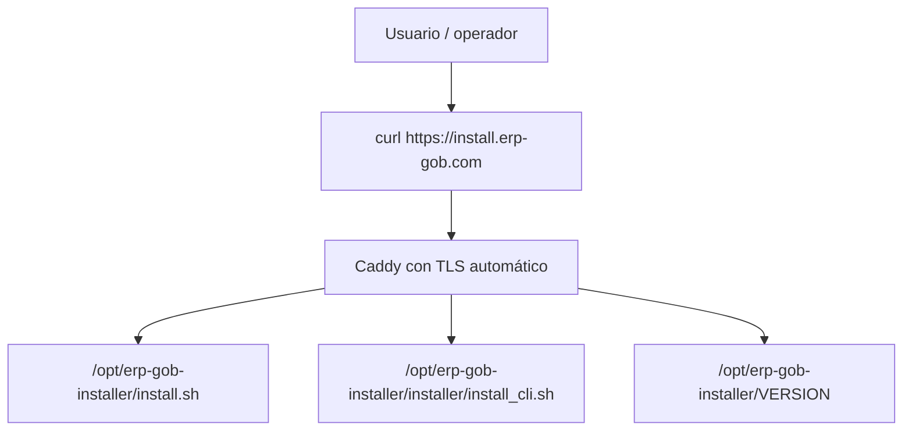

# Installer Publication Procedure

## Objetivo

Publicar el installer remoto oficial de ERP-GOB para permitir:

```bash
curl -sSL https://install.erp-gob.com | bash
erp-gob install demo
```

## Arquitectura



## Estructura del servidor

```text
/opt/erp-gob-installer
  install.sh
  VERSION
  checksums.txt
  installer/
    install_cli.sh
    update_installer.sh
```

## DNS requerido

Crear un registro `A` o `CNAME` para:

- `install.erp-gob.com`

Debe apuntar al VPS que ejecutará Caddy.

## Procedimiento completo para VPS Ubuntu

### 1. Crear usuario operativo

```bash
sudo adduser --system --group --home /opt/erp-gob-installer erpgob-installer
sudo mkdir -p /opt/erp-gob-installer/installer
sudo chown -R root:root /opt/erp-gob-installer
```

### 2. Instalar Caddy

```bash
sudo apt update
sudo apt install -y debian-keyring debian-archive-keyring apt-transport-https curl
curl -1sLf 'https://dl.cloudsmith.io/public/caddy/stable/gpg.key' | \
  sudo gpg --dearmor -o /usr/share/keyrings/caddy-stable-archive-keyring.gpg
curl -1sLf 'https://dl.cloudsmith.io/public/caddy/stable/debian.deb.txt' | \
  sudo tee /etc/apt/sources.list.d/caddy-stable.list
sudo apt update
sudo apt install -y caddy
```

### 3. Instalar configuración de Caddy

```bash
sudo cp installer/publish/Caddyfile /etc/caddy/Caddyfile
sudo caddy validate --config /etc/caddy/Caddyfile
sudo systemctl enable caddy
sudo systemctl restart caddy
```

### 4. Publicar installer

```bash
sudo REF=main VERSION=v1.19.2-suite \
  bash installer/publish/update_installer.sh
```

### 5. Validar HTTPS automático

```bash
curl -I https://install.erp-gob.com/install.sh
curl -sSL https://install.erp-gob.com/version
curl -sSL https://install.erp-gob.com/checksums.txt
```

## Publicación del installer

El script `installer/publish/update_installer.sh`:

1. descarga la versión de `installer/install_cli.sh`
2. publica `install.sh` en `/opt/erp-gob-installer`
3. publica `installer/install_cli.sh`
4. copia `installer/update_installer.sh`
5. recalcula `checksums.txt`
6. actualiza `VERSION`
7. recarga Caddy

## Smoke final

Desde una máquina limpia:

```bash
curl -sSL https://install.erp-gob.com | bash
erp-gob version
erp-gob install demo
erp-gob validate
erp-gob smoke
```

## Criterio de aceptación

1. `install.erp-gob.com` responde con TLS válido.
2. `/install.sh` responde `200`.
3. `/version` devuelve la versión esperada.
4. el script instala `erp-gob` globalmente.
5. `erp-gob install demo` completa el bootstrap.
6. `erp-gob validate` y `erp-gob smoke` devuelven PASS.
