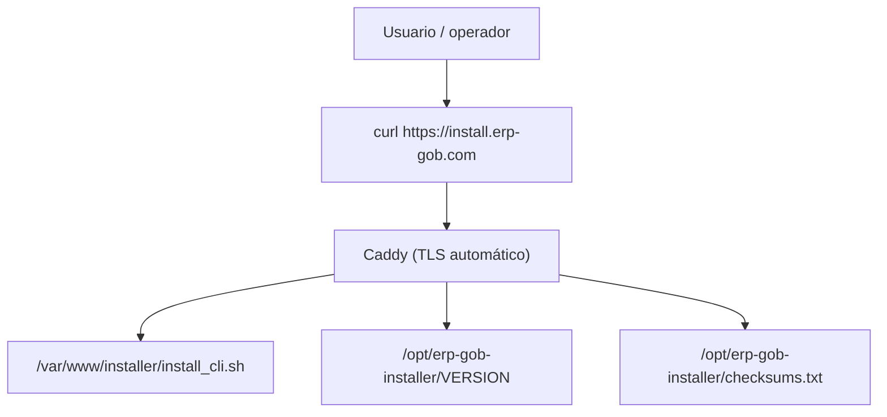

# Remote Installer Deployment v1.19.1

## Objetivo

Publicar el installer remoto oficial de ERP-GOB para permitir:

```bash
curl -sSL https://install.erp-gob.com | bash
erp-gob install demo
```

Sin modificar backend, frontend ni la lógica actual del CLI.

## Arquitectura mínima



## Estructura recomendada del servidor

```text
/opt/erp-gob-installer
  install_cli.sh
  checksums.txt
  VERSION

/var/www/installer
  install_cli.sh
  install.sh -> install_cli.sh
```

## Requisitos del servidor

- Ubuntu 24.04 LTS o Debian 12
- DNS público apuntando `install.erp-gob.com` al servidor
- puertos `80` y `443` abiertos
- acceso root o sudo
- Caddy instalado desde repositorio oficial

## Instalación de Caddy

### Ubuntu / Debian

```bash
sudo apt update
sudo apt install -y debian-keyring debian-archive-keyring apt-transport-https curl
curl -1sLf 'https://dl.cloudsmith.io/public/caddy/stable/gpg.key' | \
  sudo gpg --dearmor -o /usr/share/keyrings/caddy-stable-archive-keyring.gpg
curl -1sLf 'https://dl.cloudsmith.io/public/caddy/stable/debian.deb.txt' | \
  sudo tee /etc/apt/sources.list.d/caddy-stable.list
sudo apt update
sudo apt install -y caddy
```

## Despliegue inicial

### 1. Crear estructura de directorios

```bash
sudo mkdir -p /opt/erp-gob-installer /var/www/installer /var/log/caddy
sudo chown -R root:root /opt/erp-gob-installer /var/www/installer
```

### 2. Instalar configuración de Caddy

```bash
sudo cp installer/publish/Caddyfile /etc/caddy/Caddyfile
sudo caddy validate --config /etc/caddy/Caddyfile
sudo systemctl reload caddy
```

### 3. Publicar el installer

```bash
sudo REF=main VERSION=v1.19.1-suite \
  bash installer/publish/update_installer.sh
```

## Seguridad recomendada

### Headers

Ya incluidos en `installer/publish/Caddyfile`:

- `Content-Security-Policy`
- `X-Content-Type-Options`
- `X-Frame-Options`
- `Referrer-Policy`
- `Permissions-Policy`

### Rate limit básico

Caddy core no incluye rate limiting nativo. Para mantener la instalación simple y reproducible, aplicar limitación básica en el host:

```bash
sudo apt install -y ufw
sudo ufw allow 80/tcp
sudo ufw limit 443/tcp
sudo ufw enable
```

Opcional:

- `fail2ban` para patrones anómalos
- balanceador upstream si el dominio público crece

## Actualización del installer

Para publicar una nueva versión:

```bash
sudo REF=main VERSION=v1.19.1-suite \
  bash installer/publish/update_installer.sh
```

Resultado esperado:

- `/opt/erp-gob-installer/install_cli.sh` actualizado
- `/opt/erp-gob-installer/checksums.txt` actualizado
- `/opt/erp-gob-installer/VERSION` actualizado
- `/var/www/installer/install_cli.sh` publicado

## Validación desde host limpio

```bash
curl -I https://install.erp-gob.com
curl -sSL https://install.erp-gob.com | head
curl -sSL https://install.erp-gob.com/version
curl -sSL https://install.erp-gob.com/checksums.txt
```

Luego:

```bash
curl -sSL https://install.erp-gob.com | bash
erp-gob version
erp-gob install demo
erp-gob smoke
```

## Checklist de publicación

1. DNS `install.erp-gob.com` apunta al servidor correcto.
2. `caddy validate` devuelve `valid configuration`.
3. `https://install.erp-gob.com` responde `200`.
4. `https://install.erp-gob.com/version` devuelve la versión publicada.
5. `https://install.erp-gob.com/checksums.txt` devuelve checksum SHA256.
6. `curl -sSL https://install.erp-gob.com | bash` instala `erp-gob`.
7. `erp-gob version` responde la versión esperada.
8. `erp-gob install demo` completa bootstrap.
9. `erp-gob smoke` devuelve PASS.
