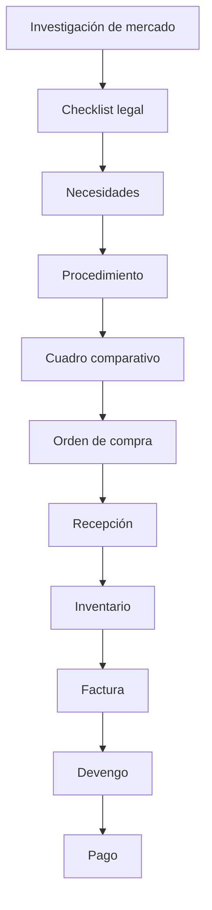

# RUNBOOK_OPERATIVO_v1.11

**Sistema:** ERP Gubernamental de Abastecimiento  
**Versión operacional:** v1.11.0  
**Base arquitectónica:** `docs/architecture/SYSTEM_ARCHITECTURE_v1.11.md`  
**Ámbito:** Operación diaria, adopción institucional, auditoría y continuidad operativa.

---

## 1. Objetivo Del Documento

Este runbook describe cómo operar el ERP institucional por rol, usando únicamente flujos implementados en v1.11.

Objetivos de uso:
- Capacitación de personal operativo y de control.
- Estandarización de ejecución diaria del proceso de compra pública.
- Soporte a auditoría interna/OIC con trazabilidad verificable.
- Continuidad operativa ante rotación de personal.

---

## 2. Roles Del Sistema

> Referencia técnica de roles en frontend: `ADMIN`, `USER`, `OIC.READONLY`, `OPS.CONSULTAR`.

### 2.1 Capturista / Operador administrativo
**Responsabilidad:** Captura y avance secuencial del expediente.

Puede operar:
- Expediente (consulta operativa y avance de pasos).
- Investigación de mercado.
- Checklist legal.
- Necesidades.
- Procedimiento (captura básica).
- Recepción e inventario operativo.
- Registro de factura en flujo financiero.

No debe ejecutar:
- Tareas de supervisión/auditoría institucional.
- Gestión técnica/administrativa del sistema.

### 2.2 Revisor / Responsable de área
**Responsabilidad:** Verificar integridad técnica y secuencial de expediente.

Puede operar:
- Revisión de expediente completo.
- Validación de necesidades y consistencia de procedimiento.
- Revisión de cuadro comparativo y orden.
- Confirmación documental antes de recepción y finanzas.

### 2.3 Área financiera
**Responsabilidad:** Cierre financiero de contrato/expediente.

Puede operar:
- Registro y actualización de factura.
- Generación de devengo desde factura.
- Registro de pago desde devengo.
- Revisión de estado financiero por contrato.

### 2.4 OIC / Auditoría
**Responsabilidad:** Control institucional y detección de desvíos.

Puede operar (solo lectura):
- Observabilidad institucional.
- Timeline consolidado de expediente.
- Riesgos, alertas y operaciones fuera de secuencia.
- Consulta transversal de expedientes/proveedores.
- Descarga y revisión de evidencia documental disponible.

No puede:
- Modificar datos operativos ni ejecutar mutaciones.

### 2.5 Administrador del sistema
**Responsabilidad:** Salud técnica y gobierno operativo del ERP.

Puede operar:
- Gestión de accesos/roles (Keycloak y configuración).
- Supervisión de catálogos maestros (proveedores/productos).
- Verificación de observabilidad técnica y métricas.
- Soporte de operación y continuidad de ambiente.

---

## 3. Flujo Operativo Real Del Sistema

### 3.1 Matriz de pasos
| Paso | Propósito | Responsable primario | Datos requeridos (mínimo) | Salida esperada |
|---|---|---|---|---|
| Investigación de mercado | Establecer referencia técnica-económica | Capturista / Revisor | Fuentes, descripción, precio referencia, evidencia | Investigación registrada |
| Checklist legal | Validar requisitos legales previos | Capturista / Revisor | Ítems de cumplimiento y evidencia | Checklist actualizado |
| Necesidades | Formalizar requerimiento | Capturista | Datos de necesidad por expediente | Necesidad creada |
| Procedimiento | Iniciar proceso de contratación | Capturista / Revisor | Tipo/clasificación y contexto | Procedimiento creado |
| Cuadro comparativo | Evaluación de propuestas | Revisor | Información comparativa existente | Cuadro visible para decisión |
| Orden | Formalizar adjudicación | Revisor / Operación | Referencias del procedimiento/cuadro | Orden emitida |
| Recepción | Registrar cumplimiento físico/documental | Capturista | Orden, fecha, recepción | Recepción registrada |
| Inventario | Reflejar impacto de recepción | Operación almacén | Ajuste/conteo/estado inventario | Existencia y kardex actualizados |
| Factura | Iniciar cierre financiero | Área financiera | Orden, XML/PDF, datos factura | Factura registrada |
| Devengo | Reconocer obligación financiera | Área financiera | Factura y monto devengo | Devengo creado |
| Pago | Registrar pago final | Área financiera | Devengo y monto pago | Pago creado |

---

## 4. Operación Paso A Paso Por Rol

## 4.1 Capturista / Operador administrativo

### Paso 1 — Abrir expediente operativo
**Ruta UI:** `/expedientes/{expedienteId}`  
**Ruta recomendada para ejecución guiada:** `/expedientes/{expedienteId}/wizard`

**Datos requeridos:** `expedienteId` válido.  
**Resultado esperado:** vista de overview, estado actual y siguientes pasos.

### Paso 2 — Registrar investigación de mercado
**Ruta UI:** `/expedientes/{expedienteId}/investigacion`

Registrar:
- Fuentes consultadas.
- Descripción.
- Precio referencial.
- Documento/evidencia asociada.

**Resultado esperado:** investigación visible en panel y usada por reglas de riesgo.

### Paso 3 — Completar checklist legal
**Ruta UI:** `/expedientes/{expedienteId}/checklist`

Registrar estado de ítems legales y evidencia asociada.

**Resultado esperado:** checklist actualizado; habilita continuidad secuencial.

### Paso 4 — Capturar necesidades
**Ruta UI:** `/expedientes/{expedienteId}/sc`

Capturar necesidades requeridas por el expediente.

**Resultado esperado:** listado de necesidades disponible para procedimiento.

### Paso 5 — Registrar recepción
**Ruta UI:** `/expedientes/{expedienteId}/recepciones` y detalle `/expedientes/{expedienteId}/recepciones/{id}`

**Resultado esperado:** recepción registrada y trazable.

---

## 4.2 Revisor / Responsable de área

### Paso 1 — Verificar expediente integral
**Ruta UI:** `/expedientes/{expedienteId}`

Validar consistencia de:
- Investigación.
- Checklist.
- Necesidades.
- Procedimiento.

### Paso 2 — Revisar procedimiento y cuadro
**Rutas UI:**
- `/expedientes/{expedienteId}/procedimientos`
- `/expedientes/{expedienteId}/procedimientos/{id}`
- `/cuadro/{id}`

**Resultado esperado:** decisión sustentada para emisión/seguimiento de orden.

### Paso 3 — Revisar orden y continuidad
**Ruta UI:** `/ordenes/{id}` o `/expedientes/{expedienteId}/ordenes/{id}`

**Resultado esperado:** orden en estado consistente con secuencia institucional.

---

## 4.3 Área financiera

### Paso 1 — Factura
**Ruta UI:** `/expedientes/{expedienteId}/finanzas` o `/finanzas/{contratoId}`

Acciones:
- Registrar factura.
- Actualizar estado de factura.

**Resultado esperado:** factura disponible para devengo.

### Paso 2 — Devengo
**Ruta UI:** misma vista de finanzas.

Acción:
- Generar devengo desde factura.

**Resultado esperado:** devengo registrado y vinculable a pago.

### Paso 3 — Pago
**Ruta UI:** misma vista de finanzas.

Acción:
- Registrar pago desde devengo.

**Resultado esperado:** cierre financiero operativo del contrato.

---

## 4.4 OIC / Auditoría

### Paso 1 — Supervisar dashboard de riesgos
**Ruta UI:** `/observabilidad`

Paneles:
- Expedientes con riesgo.
- Proveedores alertados.
- Operaciones fuera de secuencia.

### Paso 2 — Revisar timeline de expediente
**Ruta UI:** `/observabilidad/expedientes/{expedienteId}`

**Resultado esperado:** trazabilidad de eventos institucionales en orden temporal.

### Paso 3 — Revisar alertas por proveedor
**Ruta UI:** `/observabilidad/proveedores/{proveedorId}`

**Resultado esperado:** alertas con severidad y evidencia resumida.

---

## 4.5 Administrador del sistema

### Paso 1 — Verificar salud de plataforma
Validar disponibilidad de:
- Frontend (`/login`).
- Backend (`/metrics`).
- Keycloak realm OIDC.
- MinIO y Postgres/Redis.

### Paso 2 — Supervisar operación institucional
Revisar:
- Accesos y perfiles en Keycloak.
- Estado de servicios docker en suite.
- Evolución de alertas y métricas operativas.

---

## 5. Uso Del Wizard De Procedimiento

**Ruta:** `/expedientes/{expedienteId}/wizard`

Pasos del wizard institucional:
1. Expediente
2. Necesidades
3. Investigación de mercado
4. Checklist legal
5. Procedimiento
6. Cuadro comparativo
7. Orden de compra
8. Recepción
9. Inventario
10. Finanzas

Comportamiento:
- **✓** completado
- **●** paso activo
- **○** pendiente
- **Bloqueado** cuando no se cumple secuencia previa

Objetivo operativo:
- Reducir errores de navegación.
- Forzar avance conforme al flujo institucional implementado.

---

## 6. Operación De Proveedores

**Rutas UI:**
- `/proveedores`
- `/proveedores/{id}`

Operación disponible:
- Alta y edición de proveedor.
- Cambio de estado.
- Gestión de contactos y domicilios.
- Consulta de padrón y declaraciones.
- Consulta de score, relaciones, alertas y desempeño.

Resultado esperado:
- Proveedor validado y trazable antes de procesos críticos de contratación.

---

## 7. Operación De Productos

**Rutas UI:**
- `/productos`
- `/productos/{id}`
- Inventario por producto: `/inventario/productos/{productoId}`

Operación disponible:
- Alta de producto.
- Edición de datos.
- Cambio de estado.
- Consulta de disponibilidad/impacto en inventario.

---

## 8. Observabilidad Institucional

**Ruta principal:** `/observabilidad`

Paneles operativos:
- Expedientes con riesgo.
- Proveedores con alertas.
- Operaciones fuera de secuencia.

Vistas de detalle:
- Timeline y riesgos por expediente.
- Alertas por proveedor.
- Alertas de inventario.

Uso recomendado:
1. Revisar resumen diario.
2. Priorizar expedientes críticos.
3. Inspeccionar evidencia del riesgo (timeline + metadata).
4. Solicitar corrección al área operativa responsable.

---

## 9. Buenas Prácticas Operativas

- Registrar investigación de mercado antes de consolidar decisión procedimental.
- Completar checklist legal antes de etapas que comprometen ejecución.
- Evitar emitir órdenes sin consistencia documental previa.
- Registrar recepción en tiempo real para mantener inventario sincronizado.
- Ejecutar factura -> devengo -> pago en secuencia financiera.
- Revisar observabilidad diariamente para detección temprana.

---

## 10. Procedimiento Ante Errores

### 10.1 Recepción incorrecta
Acción operativa:
- Documentar incidencia.
- Registrar ajuste de inventario en módulo de inventario write.
- Verificar consistencia en timeline/observabilidad.

### 10.2 Factura incorrecta
Acción operativa:
- Corregir factura antes de generar/confirmar devengo.
- Revalidar estados en panel de finanzas.

### 10.3 Secuencia fuera de orden detectada por observabilidad
Acción operativa:
- Revisar evidencia del evento/riesgo.
- Regularizar paso faltante.
- Dejar rastro documental y bitácora asociada.

---

## 11. Evidencia Institucional

El sistema conserva evidencia por múltiples capas:
- **Documentos:** adjuntos/evidencias en control documental (MinIO).
- **Eventos:** bitácora y eventos jurídicos/procedimentales.
- **Timeline:** consolidación cronológica del expediente.
- **Observabilidad:** reglas de riesgo y alertas deduplicadas.

Esto habilita:
- Auditoría posterior.
- Reconstrucción de secuencia.
- Soporte para control interno institucional.

---

## 12. Apéndice Técnico

### 12.1 URLs operativas
- Frontend: `http://localhost:13001`
- Backend: `http://localhost:13000`
- Keycloak: `http://localhost:8080`
- MinIO Console: `http://localhost:9001`

### 12.2 Roles (referencia)
- `ADMIN`
- `USER`
- `OIC.READONLY`
- `OPS.CONSULTAR`

### 12.3 Endpoints clave (referencia rápida)
- Expediente: `POST/GET/PATCH /expedientes*`
- Investigación: `POST/GET/PATCH /investigacion-mercado*`
- Checklist: `GET/PATCH /expedientes/{id}/checklist`
- Procedimiento: `POST /expedientes/{id}/procedimientos`, `GET/PATCH /procedimientos/{id}`
- Orden: `POST/GET/PATCH /ordenes*`
- Recepción: `POST/GET/PATCH /recepciones*`
- Inventario write: `POST/GET/PATCH /inventory/*`
- Finanzas:
  - `POST/PATCH /facturas*`
  - `POST /facturas/{id}/devengo`
  - `POST /devengos/{id}/pago`
- Observabilidad: `GET /observabilidad/*`

### 12.4 Estructura mínima del expediente operativo
- Identificación de expediente.
- Investigación y checklist legal.
- Necesidades/procedimiento/cuadro.
- Orden, recepción e inventario.
- Factura, devengo y pago.
- Evidencia/timeline/riesgos asociados.

---

**Estado del documento:** operativo para capacitación, adopción y auditoría en entorno v1.11.
