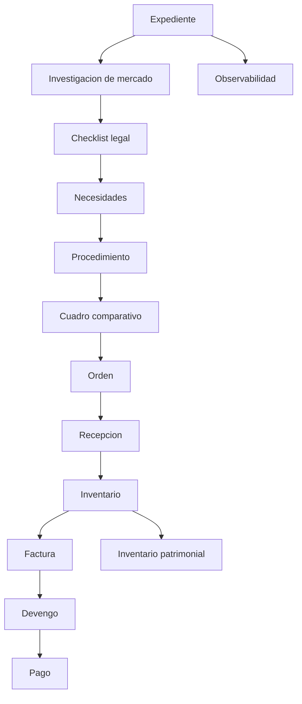

# UAT_PLAN_v1.12

**Sistema:** ERP Gubernamental de Abastecimiento  
**Version objetivo:** v1.12  
**Tipo de documento:** Plan institucional de User Acceptance Testing  
**Base documental:**
- `docs/architecture/SYSTEM_ARCHITECTURE_v1.11.md`
- `docs/operations/RUNBOOK_OPERATIVO_v1.11.md`
- `docs/manual/MANUAL_SISTEMA_v1.11.md`
- `docs/governance/CONTROL_INTERNO_MATRIX_v1.11.md`
- `docs/governance/SECURITY_HARDENING_v1.12.md`

## 1. Objetivo

Definir el plan de validacion funcional por rol para aceptar institucionalmente el ERP-GOB en su baseline v1.12.

El UAT debe confirmar:

- que cada rol puede ejecutar las acciones que le corresponden;
- que las restricciones de acceso se respetan;
- que el flujo completo de compra publica funciona de punta a punta;
- que observabilidad, inventario y financiero responden de forma consistente;
- que el sistema es operable por areas administrativas, financieras y de control.

## 2. Alcance

Flujo operativo cubierto por este UAT:



Dominios incluidos:

- Expedientes
- Investigacion de mercado
- Checklist legal
- Necesidades
- Procedimientos
- Cuadro comparativo
- Ordenes
- Recepciones
- Inventario operativo
- Finanzas
- Observabilidad
- Proveedores
- Productos
- Inventario patrimonial

## 3. Criterios de entrada

El UAT solo inicia si se cumple lo siguiente:

- stack `erp-gob-suite` levanta correctamente con Docker;
- login OIDC funciona;
- `/api/auth/me` devuelve `authenticated: true`;
- backend, frontend, postgres, redis, keycloak y minio estan disponibles;
- seed institucional esta cargado;
- roles de prueba disponibles:
  - `capturista`
  - `revisor`
  - `finanzas`
  - `oic`
  - `admin`

## 4. Criterios de salida

El UAT se considera satisfactorio si:

- todos los flujos esperados por rol pasan;
- los bloqueos de seguridad/RBAC se respetan;
- no existen errores de secuencia en wizard o workspace;
- timeline, riesgos y bitacora son coherentes con las acciones ejecutadas;
- no se detectan errores criticos de navegacion, datos o permisos.

## 5. Ambiente de prueba

Repositorio base:

- `erp-gob-suite`

Arranque esperado:

```bash
docker compose down -v
docker compose up --build
```

URLs operativas:

- Frontend: `http://localhost:13001`
- Backend: `http://localhost:13000`
- Keycloak: `http://localhost:8080`
- MinIO console: `http://localhost:9001`

## 6. Roles UAT

### 6.1 Capturista

**Objetivo del rol:** ejecutar el flujo operativo del expediente sin salir del proceso guiado.

**Flujo esperado:**

1. Abrir expediente.
2. Registrar investigacion de mercado.
3. Completar checklist legal.
4. Registrar necesidades.
5. Crear o avanzar procedimiento.
6. Generar orden si corresponde.
7. Registrar recepcion.
8. Ver impacto en inventario.
9. Registrar factura si el flujo operativo lo requiere.

**Acciones permitidas:**

- consultar expediente y wizard;
- registrar investigacion;
- editar checklist segun politicas del flujo;
- crear necesidades;
- crear o actualizar procedimiento en contexto operativo;
- generar orden si el estado del flujo lo permite;
- registrar recepcion;
- consultar inventario operativo;
- registrar factura operativa.

**Acciones bloqueadas:**

- aprobar o simular funciones de OIC;
- consultar paneles de control reservados a auditoria;
- ejecutar pagos;
- modificar configuraciones de sistema;
- realizar administracion de usuarios o catalogos sensibles fuera de su alcance.

### 6.2 Revisor

**Objetivo del rol:** validar consistencia tecnica y secuencial antes de que el expediente siga avanzando.

**Flujo esperado:**

1. Revisar expediente completo.
2. Validar investigacion y checklist.
3. Revisar necesidades.
4. Revisar procedimiento.
5. Consultar cuadro comparativo.
6. Validar orden para continuidad operativa.

**Acciones permitidas:**

- consultar expediente, procedimientos y cuadro;
- revisar timeline y estatus por paso;
- validar consistencia documental y secuencial;
- confirmar que orden y recepcion esten soportadas.

**Acciones bloqueadas:**

- registrar pago;
- administrar usuarios o Keycloak;
- operar paneles reservados solo a OIC;
- alterar configuracion general del sistema.

### 6.3 Finanzas

**Objetivo del rol:** cerrar el flujo financiero del contrato sin romper la trazabilidad.

**Flujo esperado:**

1. Consultar contrato/expediente listo para cierre financiero.
2. Registrar factura.
3. Generar devengo.
4. Registrar pago.
5. Validar que timeline y estados financieros se actualicen.

**Acciones permitidas:**

- registrar y actualizar facturas;
- generar devengos;
- registrar pagos;
- consultar panel financiero por contrato o expediente;
- revisar evidencias vinculadas a factura/devengo/pago.

**Acciones bloqueadas:**

- capturar investigacion de mercado;
- operar checklist legal como proceso principal;
- crear o modificar ordenes/recepciones fuera de su ambito;
- administrar sistema o usuarios.

### 6.4 OIC

**Objetivo del rol:** supervisar y auditar el proceso sin alterar datos operativos.

**Flujo esperado:**

1. Abrir dashboard de observabilidad.
2. Consultar expedientes con riesgo.
3. Revisar timeline consolidado del expediente.
4. Validar alertas de proveedor, secuencia y desviaciones.
5. Revisar control patrimonial OIC.
6. Verificar evidencia documental cuando aplique.

**Acciones permitidas:**

- consultar observabilidad;
- consultar timeline, riesgos y alertas;
- consultar proveedores, productos e inventario;
- consultar panel patrimonial OIC;
- auditar secuencia expediente -> orden -> recepcion -> finanzas.

**Acciones bloqueadas:**

- crear, editar o borrar datos operativos;
- registrar necesidades, procedimientos, recepciones, facturas o pagos;
- administrar usuarios o configuracion;
- realizar mutaciones patrimoniales.

### 6.5 Admin

**Objetivo del rol:** validar operacion integral, acceso transversal y continuidad funcional del sistema.

**Flujo esperado:**

1. Verificar acceso general a modulos.
2. Consultar proveedores y productos.
3. Validar observabilidad.
4. Validar inventario operativo y patrimonial.
5. Confirmar que RBAC se cumpla para otros roles.
6. Revisar estado general del sistema y navegacion.

**Acciones permitidas:**

- acceso transversal a los modulos habilitados;
- consulta de dashboard operativo y observabilidad;
- consulta y administracion permitida por UI institucional;
- soporte funcional de primer nivel.

**Acciones bloqueadas:**

- ninguna restriccion funcional relevante en UAT, salvo acciones no implementadas por contrato.

## 7. Matriz resumida de aceptacion por rol

| Rol | Flujo esperado | Acciones permitidas | Acciones bloqueadas |
| --- | --- | --- | --- |
| Capturista | Expediente -> investigacion -> checklist -> necesidades -> procedimiento -> orden -> recepcion | Captura operativa y avance del flujo | Pago, auditoria, admin sistema |
| Revisor | Revision expediente -> cuadro -> orden | Consulta y validacion de consistencia | Pago, admin, mutaciones fuera de rol |
| Finanzas | Factura -> devengo -> pago | Registro financiero completo | Captura juridica/operativa no financiera |
| OIC | Observabilidad -> timeline -> alertas -> control patrimonial | Solo lectura, auditoria y control | Toda mutacion operativa |
| Admin | Validacion transversal del sistema | Acceso integral operativo/tecnico | Solo lo no implementado contractualmente |

## 8. Escenarios UAT obligatorios

### 8.1 Escenario E2E principal

**Rol ejecutor:** Capturista + Revisor + Finanzas  
**Objetivo:** validar el flujo institucional completo.

Pasos:

1. Crear o abrir expediente.
2. Registrar investigacion de mercado.
3. Completar checklist legal.
4. Registrar necesidades.
5. Crear procedimiento.
6. Consultar cuadro comparativo.
7. Generar orden.
8. Registrar recepcion.
9. Verificar inventario.
10. Registrar factura.
11. Generar devengo.
12. Registrar pago.

Resultado esperado:

- el expediente avanza sin errores de secuencia;
- el timeline refleja los hitos;
- el wizard muestra el siguiente paso correcto;
- el panel financiero se actualiza correctamente.

### 8.2 Escenario de control OIC

**Rol ejecutor:** OIC  
**Objetivo:** confirmar visibilidad completa sin capacidad de mutacion.

Pasos:

1. Abrir `/observabilidad`.
2. Consultar dashboard resumen.
3. Abrir un expediente con timeline.
4. Consultar riesgos.
5. Abrir `/inventario/patrimonial/control`.

Resultado esperado:

- visualizacion correcta de paneles;
- sin botones mutables funcionales;
- sin permisos de escritura.

### 8.3 Escenario patrimonial

**Rol ejecutor:** Admin o usuario operativo autorizado  
**Objetivo:** validar inventario patrimonial.

Pasos:

1. Abrir `/inventario/patrimonial/activos`.
2. Consultar `/inventario/patrimonial/resguardos`.
3. Crear resguardo.
4. Entregar activo.
5. Devolver activo.
6. Consultar activos por resguardante.
7. Revisar `/inventario/patrimonial/control`.

Resultado esperado:

- flujo patrimonial consistente;
- control OIC refleja activos sin resguardo, duplicados o no devueltos cuando exista evidencia;
- no hay recargas innecesarias ni errores de navegacion.

## 9. Casos de bloqueo obligatorios

Estos casos deben ejecutarse en UAT:

1. OIC intenta mutar informacion y el sistema lo bloquea.
2. Capturista intenta registrar pago y el sistema lo bloquea.
3. Finanzas intenta alterar componentes juridicos o de investigacion y el sistema lo bloquea o no expone la accion.
4. Usuario sin rol valido intenta acceder a modulo privado y es redirigido o rechazado.

## 10. Evidencia UAT requerida

Por cada caso aprobado se debe guardar:

- rol ejecutor;
- fecha y hora;
- expediente o entidad probada;
- resultado (`PASS` / `FAIL`);
- `correlationId` si existio incidente;
- capturas de pantalla cuando aplique;
- observaciones del usuario.

## 11. Formato de registro UAT

| Caso | Rol | Flujo | Resultado esperado | Resultado obtenido | Estado | Evidencia |
| --- | --- | --- | --- | --- | --- | --- |
| UAT-001 | Capturista | Registro de investigacion | Investigacion creada | Pendiente | Pendiente | Pendiente |
| UAT-002 | Revisor | Consulta de cuadro | Cuadro visible | Pendiente | Pendiente | Pendiente |
| UAT-003 | Finanzas | Registro de pago | Pago creado | Pendiente | Pendiente | Pendiente |
| UAT-004 | OIC | Consulta observabilidad | Dashboard visible sin mutacion | Pendiente | Pendiente | Pendiente |
| UAT-005 | Admin | Flujo patrimonial | Resguardo entregado/devuelto | Pendiente | Pendiente | Pendiente |

## 12. Riesgos a vigilar durante UAT

- errores 401/403 por desalineacion de roles;
- rutas bloqueadas por contrato del gateway;
- saltos incorrectos del wizard;
- eventos faltantes en timeline;
- inconsistencias entre recepcion, inventario y finanzas;
- problemas de solo lectura en OIC;
- divergencia entre inventario operativo y patrimonial.

## 13. Dictamen de aceptacion

Se recomienda declarar aceptacion funcional de v1.12 solo si:

- los cinco roles completan sus escenarios principales;
- no hay bloqueos criticos en login, flujo E2E, observabilidad o patrimonial;
- RBAC bloquea correctamente las acciones no permitidas;
- la evidencia de UAT queda resguardada para auditoria.

## 14. Resultado esperado del UAT

Al cierre del UAT institucional, la organizacion debe poder afirmar que:

- el sistema soporta el flujo operativo real por rol;
- las restricciones institucionales se cumplen;
- la auditoria y observabilidad son utilizables;
- el ERP esta listo para pasar de validacion tecnica a validacion operativa formal.
