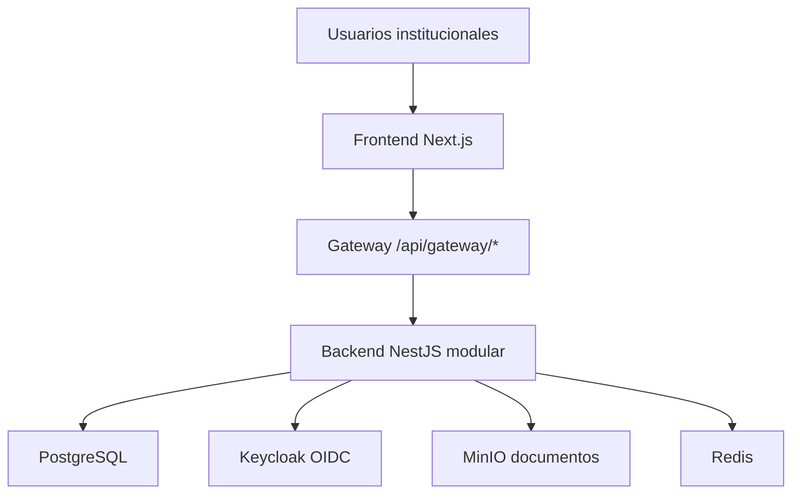
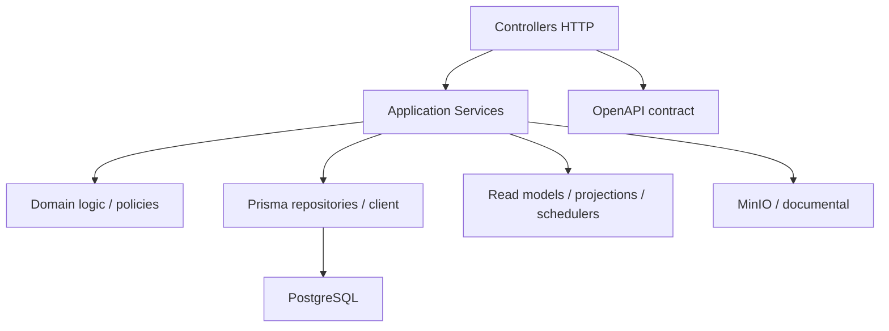
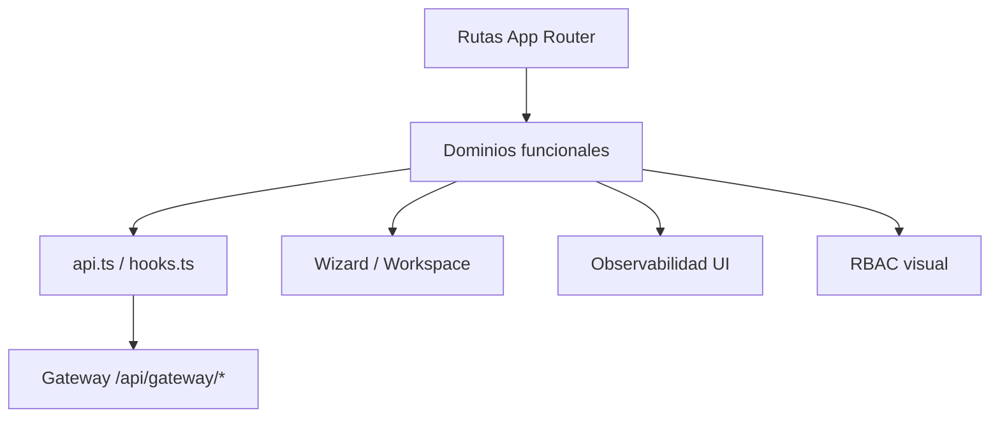
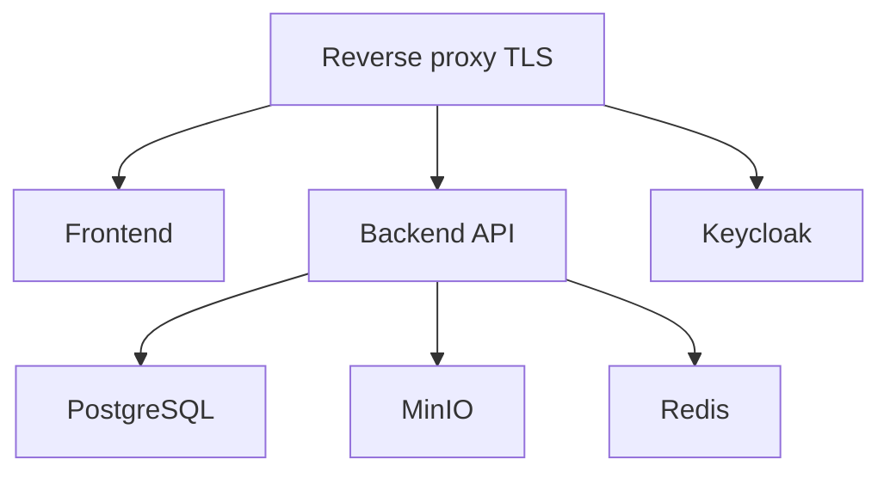
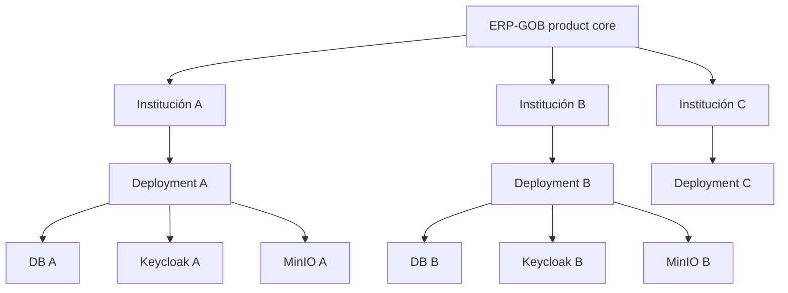
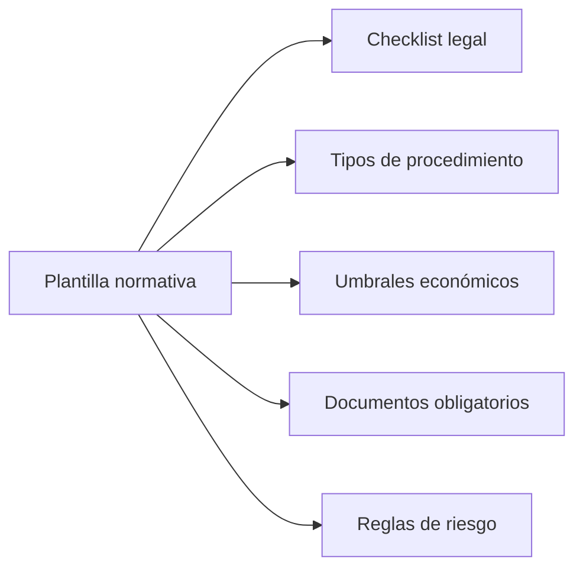
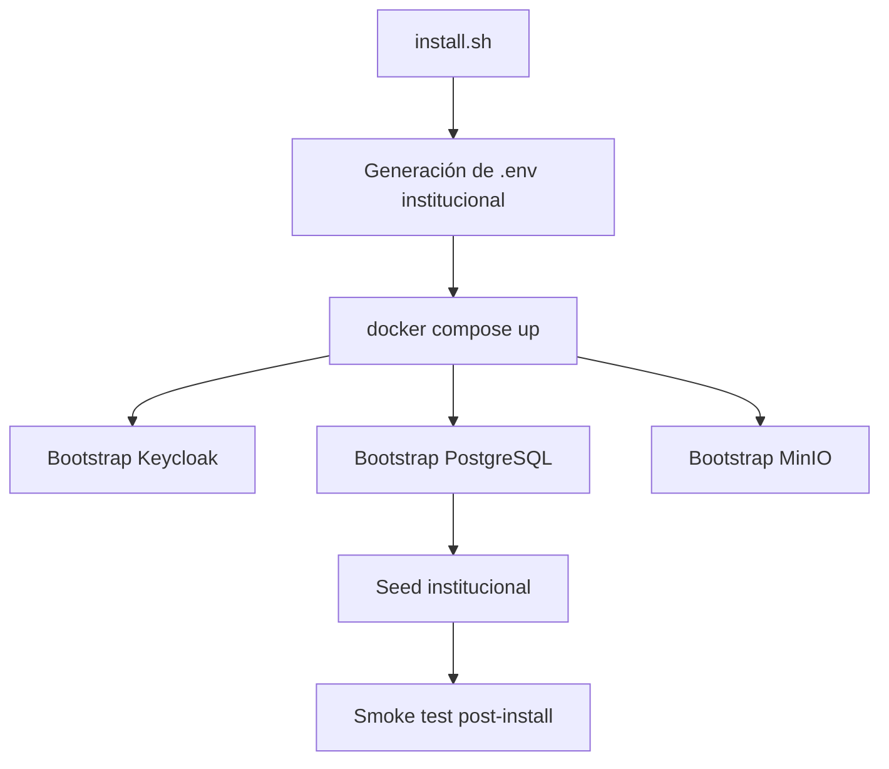

# ERP_GOB_GOVTECH_BLUEPRINT_v1

**Producto:** ERP-GOB  
**Propósito:** definir cómo convertir ERP-GOB en una plataforma GovTech vendible para gobiernos estatales y municipales.  
**Base tecnológica actual:** backend NestJS + Prisma, frontend Next.js, OIDC con Keycloak, MinIO, Redis, PostgreSQL, suite Docker reproducible.  
**Base documental alineada:**
- `docs/architecture/SYSTEM_ARCHITECTURE_v1.11.md`
- `docs/product/PRODUCT_STRATEGY_GOVERNMENT_v1.md`
- `docs/product/MULTI_TENANT_ARCHITECTURE_v1.md`
- `docs/product/COMMERCIAL_PACKAGING_v1.md`
- `docs/governance/CONTROL_INTERNO_MATRIX_v1.11.md`

---

## 1. Visión Del Producto GovTech

### 1.1 Problema actual en gobiernos estatales y municipales

En la práctica, muchos gobiernos subnacionales operan abastecimiento con una mezcla de:
- plataformas parciales de compras;
- sistemas administrativos desacoplados;
- expedientes documentales sin trazabilidad operativa;
- validaciones jurídicas y de control fuera del sistema;
- inventario y patrimonial sin vínculo con el expediente;
- cierre financiero desconectado del origen de la compra.

El resultado es predecible:
- baja visibilidad del estado real del expediente;
- controles reactivos;
- captura repetida;
- evidencia dispersa;
- observaciones recurrentes de auditoría;
- dificultad para asignar responsabilidades.

### 1.2 Por qué los sistemas actuales fallan

Sin entrar en juicios sobre una herramienta específica, los patrones de falla en plataformas estatales, federales o internas suelen ser estos:

| Patrón de falla | Consecuencia |
|---|---|
| cubren solo una parte del proceso | el expediente se rompe entre áreas |
| son transaccionales, no observables | el control llega tarde |
| no integran compras con inventario/patrimonial | hay doble captura y brechas de trazabilidad |
| no incluyen motor de secuencia o alertas | errores humanos se convierten en hallazgos |
| dependen de oficios o controles externos | el sistema no gobierna el proceso real |

### 1.3 Cómo ERP-GOB resuelve esos problemas

ERP-GOB ya parte de una base funcional distinta:
- flujo contractual completo;
- inventario operativo;
- inventario patrimonial;
- observabilidad institucional;
- wizard operativo del expediente;
- RBAC por roles;
- OIDC centralizado;
- suite reproducible.

Eso permite que el sistema no sea solo un registro de operaciones, sino un **mecanismo de ejecución y control institucional**.

### 1.4 Propuesta de valor institucional

ERP-GOB debe presentarse como:

**plataforma institucional de abastecimiento con trazabilidad, observabilidad y control interno embebido.**

Su valor diferencial está en cuatro capacidades:
- **trazabilidad:** un expediente visible de punta a punta;
- **observabilidad institucional:** timeline, riesgos, alertas y dashboard;
- **control interno automático:** checklist, reglas de riesgo y secuencia guiada;
- **auditoría preventiva:** detección temprana antes del daño financiero o patrimonial.

---

## 2. Arquitectura Del Producto

ERP-GOB ya tiene una arquitectura técnicamente defendible para convertirse en producto.

### 2.1 Arquitectura general



### 2.2 Backend

Capacidades reales:
- NestJS modular por dominio;
- Prisma como acceso transaccional;
- OpenAPI contract-first;
- servicios por dominio;
- módulos contractuales, inventario, patrimonial, finanzas y observabilidad.



Fortalezas actuales:
- bounded modules razonables;
- HTTP contract versionado;
- pruebas backend robustas;
- disciplina de vertical slices.

### 2.3 Frontend

Capacidades reales:
- frontend modular por dominios;
- wizard operativo;
- observabilidad UI;
- paneles funcionales por dominio;
- RBAC visual;
- tipos generados desde OpenAPI;
- gateway institucional único.



### 2.4 Infraestructura

Capacidades reales:
- Docker Compose reproducible;
- Keycloak;
- PostgreSQL;
- MinIO;
- Redis;
- frontend y backend dockerizados;
- proxy TLS en la suite endurecida.



### 2.5 Lectura arquitectónica

ERP-GOB ya no necesita reinventarse para ser producto.
Lo que necesita es:
- parametrización;
- empaquetado;
- aislamiento por cliente;
- operación y soporte formal.

---

## 3. Modelo Multi-Institución

### 3.1 Principio recomendado

No asumir SaaS multi-tenant compartido como primera fase.

La arquitectura recomendada es:

**codebase única + despliegue aislado por institución**

Eso permite:
- mejor aceptación institucional;
- segregación de datos más defendible;
- operación más clara;
- menor riesgo de acceso cruzado;
- mejor narrativa de seguridad para venta pública.

### 3.2 Configuración por institución

Cada institución debe tener un bundle de configuración propio:
- nombre institucional;
- logos y branding;
- dominios;
- módulos habilitados;
- plantilla normativa;
- catálogos base;
- usuarios iniciales;
- perfil de seguridad.

### 3.3 Branding por cliente

Branding configurable:
- nombre del sistema;
- logotipo;
- paleta institucional;
- pie legal;
- dominios públicos.

### 3.4 Parametrización normativa

Debe soportarse vía configuración, no forks de código:
- checklist legal;
- tipos de procedimiento;
- umbrales;
- evidencia obligatoria;
- reglas activas de observabilidad.

### 3.5 Configuración de módulos

El producto debe poder activarse por bloques:
- Core Contractual
- Inventario
- Patrimonial
- Observabilidad
- Finanzas
- Analytics

### 3.6 Diagrama multi-institución



---

## 4. Motor Normativo

ERP-GOB no necesita un nuevo dominio funcional para adaptarse a distintos estados; necesita una **capa normativa parametrizable** sobre capacidades ya existentes.

### 4.1 Componentes a parametrizar

| Componente | Parametrización |
|---|---|
| checklist legal | ítems obligatorios por ente |
| tipos de procedimiento | modalidades válidas |
| umbrales económicos | montos por modalidad |
| documentos obligatorios | por etapa del expediente |
| reglas de observabilidad | riesgos activos y severidades |
| flujo habilitado | pasos activos y gating |

### 4.2 Plantillas normativas

Se recomienda un catálogo inicial de plantillas:
- `plantilla_federal`
- `plantilla_estado`
- `plantilla_municipal`

No significan tres productos distintos.  
Significan tres perfiles de configuración sobre el mismo núcleo.

### 4.3 Ejemplo de adaptación



### 4.4 Resultado esperado

La misma plataforma puede operar en múltiples marcos regulatorios sin alterar:
- endpoints base;
- modelo funcional;
- arquitectura principal.

---

## 5. Instalación Y Despliegue

### 5.1 Base actual

ERP-GOB ya tiene una suite reproducible con:
- frontend;
- backend;
- Keycloak;
- PostgreSQL;
- MinIO;
- Redis;
- reverse proxy;
- seed institucional;
- bootstrap de entorno.

### 5.2 Evolución objetivo

La experiencia de despliegue debe empaquetarse en un instalador institucional ejecutable como:

```bash
./install.sh
```

Ese instalador debe orquestar la suite existente, no reemplazarla.

### 5.3 Perfiles de instalación

| Perfil | Propósito |
|---|---|
| `demo` | demostración comercial |
| `piloto` | validación institucional controlada |
| `produccion` | operación formal |

### 5.4 Bootstrap automático

El instalador debe preparar:
- variables de entorno;
- despliegue Docker;
- Keycloak realm/clientes;
- buckets MinIO;
- base PostgreSQL;
- seeds iniciales;
- smoke test técnico.

### 5.5 Diagrama de instalación



### 5.6 Resultado esperado

Una institución debe poder desplegar:
- demo;
- piloto;
- producción controlada

sin depender de ajustes manuales dispersos.

---

## 6. Modelo De Licenciamiento

### 6.1 Esquema recomendado

ERP-GOB debe venderse como:
- licencia anual institucional;
- módulos opcionales;
- implantación;
- soporte;
- actualización.

### 6.2 Paquetes comerciales

| Paquete | Alcance |
|---|---|
| Core Contractual | flujo contractual del expediente |
| Inventario Operativo | recepción + inventario + almacenes |
| Inventario Patrimonial | activos + resguardos + resguardantes |
| Observabilidad Institucional | timeline + riesgos + alertas + dashboard |
| Finanzas | factura + devengo + pago |
| Analytics | tablero ejecutivo y métricas |

### 6.3 Regla comercial

No licenciar por número de pantallas.
Licenciar por:
- institución;
- módulos;
- entorno;
- soporte contratado.

---

## 7. Modelo De Soporte

### 7.1 Niveles

| Nivel | Alcance |
|---|---|
| L1 | usuarios y operación básica |
| L2 | operación institucional, configuración y despliegue |
| L3 | ingeniería, seguridad, bugs y releases |

### 7.2 Procesos que deben formalizarse

- incident response;
- monitoreo;
- backups;
- restauración;
- actualizaciones;
- validación post-release.

### 7.3 SLA sugeridos

| Criticidad | Respuesta sugerida |
|---|---|
| Crítica | menos de 4 horas |
| Alta | 1 día hábil |
| Media | 3 días hábiles |
| Baja | siguiente ventana programada |

### 7.4 Base operativa ya existente

ERP-GOB ya cuenta con base documental para esto:
- runbook operativo;
- UAT plan;
- monitoring setup;
- security baseline;
- go-live checklist.

---

## 8. Roadmap De Producto

### v1.15
- multi-institución de configuración;
- plantillas normativas;
- branding por cliente.

### v1.16
- instalador automático;
- observabilidad enterprise;
- monitoreo central.

### v1.17
- portal de clientes;
- automatización de upgrades.

### v2.0
- plataforma GovTech madura;
- interoperabilidad;
- firma electrónica;
- multi-tenant real.

---

## 9. Estrategia De Expansión

### 9.1 Entrada recomendada

La expansión a otros estados no debe hacerse con despliegues improvisados.

La secuencia correcta es:
1. diagnóstico institucional;
2. piloto acotado;
3. adaptación normativa;
4. capacitación por rol;
5. migración de datos;
6. gobierno operativo del sistema.

### 9.2 Capacitación institucional

Los roles base ya definidos en ERP-GOB permiten una estrategia clara:
- capturista;
- revisor;
- finanzas;
- OIC;
- administrador.

### 9.3 Migración de datos

La migración debe contemplar:
- catálogos;
- usuarios;
- expedientes activos;
- proveedores;
- productos;
- inventario base;
- activos patrimoniales si aplica.

### 9.4 Gobierno del sistema

Cada institución debe tener:
- responsable funcional;
- responsable técnico;
- comité de cambio;
- política de releases;
- control de configuración normativa.

---

## 10. Posicionamiento Del Producto

### 10.1 Frente a sistemas de compras estatales

ERP-GOB es distinto porque:
- no se limita a captura de proceso de compra;
- conecta compra, recepción, inventario y finanzas;
- incorpora observabilidad institucional.

### 10.2 Frente a ERPs administrativos tradicionales

ERP-GOB es distinto porque:
- está diseñado alrededor del expediente público;
- embebe control interno;
- prioriza evidencia y secuencia legal;
- no solo contabilidad o inventario aislado.

### 10.3 Frente a plataformas federales

ERP-GOB es distinto porque:
- busca operación institucional completa local;
- puede parametrizarse por ente;
- integra ejecución y control, no solo publicación o trámite.

### 10.4 Síntesis de posicionamiento

ERP-GOB debe presentarse como:

**plataforma GovTech de abastecimiento, control y trazabilidad para gobiernos estatales y municipales**

No como software genérico de administración.

---

## Conclusión

ERP-GOB ya tiene la base funcional y técnica para convertirse en plataforma GovTech.

Lo que falta para hacerlo comercializable no es inventar un producto nuevo, sino:
- empaquetar el existente;
- parametrizarlo por institución;
- formalizar despliegue y soporte;
- modular licenciamiento;
- estandarizar implantación y expansión.

La transición correcta es:

**sistema institucional real -> producto configurable -> plataforma GovTech replicable**

Ese es el camino para presentarlo ante:
- secretarías de administración;
- áreas de modernización;
- órganos de control;
- comités presupuestales;
- pilotos estatales y municipales.
