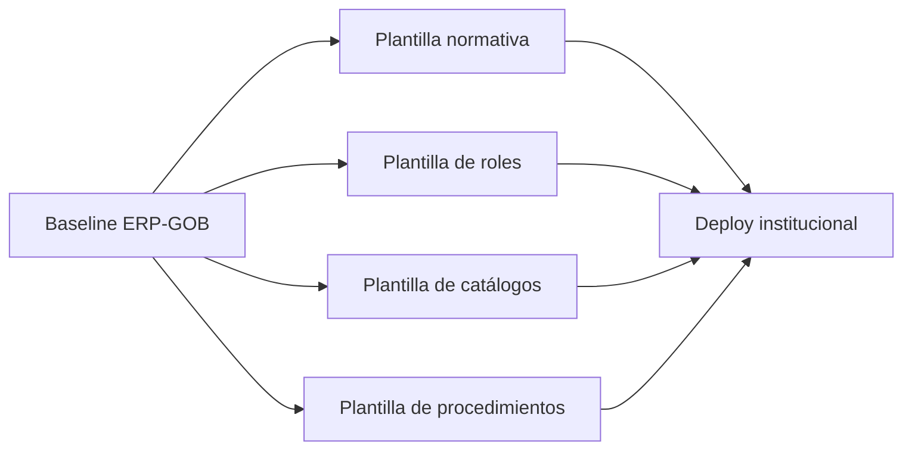

# IMPLEMENTATION_FACTORY_MODEL_v1

**Producto:** ERP-GOB  
**Propósito:** definir un modelo factory para implantar ERP-GOB de forma repetible en múltiples instituciones públicas.  
**Audiencia:** equipo de implantación, arquitectura, operación, datos, capacitación y soporte.

---

## 1. Concepto De Factory De Implementación

Un modelo factory de implementación es un esquema operativo para desplegar el mismo producto en múltiples clientes con:
- procesos repetibles;
- artefactos estandarizados;
- equipos especializados;
- menor dependencia de improvisación;
- menor riesgo de errores por proyecto.

### 1.1 Qué resuelve

Sin factory, cada implantación tiende a convertirse en:
- un proyecto artesanal;
- una reconfiguración manual;
- una nueva curva de aprendizaje;
- una fuente de retrasos y desalineación.

Con factory, la implantación se convierte en una cadena controlada:
- diagnóstico;
- parametrización;
- carga inicial;
- capacitación;
- piloto;
- operación formal.

### 1.2 Principios del modelo

| Principio | Aplicación práctica |
|---|---|
| Repetibilidad | misma secuencia de implantación para cada cliente |
| Estandarización | plantillas, seeds, roles y bundles institucionales |
| Especialización | cada rol de implantación tiene una responsabilidad clara |
| Control de calidad | gates y checklist por fase |
| Bajo riesgo | menos cambios ad hoc y menos dependencia de héroes técnicos |

### 1.3 Resultado esperado

La factory permite pasar de:
- “instalaciones únicas y frágiles”

a:

- “implantaciones escalables, auditables y predecibles”.

---

## 2. Equipo De Implantación

La implantación no debe recaer en una sola persona ni en un solo perfil técnico.

### 2.1 Líder de implantación
Responsable de:
- coordinar fases;
- gestionar cronograma;
- alinear cliente y equipo interno;
- controlar entregables y riesgos.

### 2.2 Arquitecto técnico
Responsable de:
- definir arquitectura de despliegue;
- validar seguridad, dominios, infraestructura y operación;
- asegurar consistencia del baseline;
- acompañar decisiones de integración y configuración técnica.

### 2.3 Especialista normativo
Responsable de:
- traducir marco jurídico y administrativo a configuración;
- validar checklist legal;
- definir umbrales, reglas y secuencias aplicables;
- asegurar alineación entre normativa local y producto.

### 2.4 Especialista de datos
Responsable de:
- preparar catálogos base;
- ejecutar migraciones iniciales;
- normalizar productos, proveedores, inventario y activos;
- validar calidad e integridad de datos.

### 2.5 Capacitador institucional
Responsable de:
- entrenar usuarios por rol;
- preparar materiales operativos;
- acompañar adopción inicial;
- verificar comprensión funcional del flujo.

### 2.6 Soporte operativo
Responsable de:
- atender incidencias durante piloto y arranque;
- ejecutar monitoreo y validaciones post-release;
- coordinar escalamiento a L2/L3;
- sostener continuidad operativa inicial.

### 2.7 Matriz resumida

| Rol | Enfoque principal |
|---|---|
| Líder de implantación | coordinación y gobierno del proyecto |
| Arquitecto técnico | plataforma, seguridad, despliegue |
| Especialista normativo | parametrización legal e institucional |
| Especialista de datos | carga, limpieza y validación de datos |
| Capacitador institucional | adopción y entrenamiento |
| Soporte operativo | estabilización post-implantación |

---

## 3. Fases De Implementación

### Fase 1. Diagnóstico institucional
Objetivo:
- entender cómo opera hoy la institución;
- identificar sistemas actuales;
- ubicar actores, riesgos y restricciones normativas.

Entregables:
- matriz de alcance;
- mapa de procesos;
- riesgos de implantación;
- decisión de módulos a activar.

### Fase 2. Configuración normativa
Objetivo:
- parametrizar ERP-GOB para la institución.

Incluye:
- checklist legal;
- tipos de procedimiento;
- umbrales;
- branding;
- dominios;
- módulos habilitados;
- reglas activas de observabilidad.

Entregables:
- bundle institucional;
- plantilla normativa seleccionada o adaptada;
- configuración de roles.

### Fase 3. Carga de catálogos
Objetivo:
- dejar ambiente operable con datos base.

Incluye:
- áreas institucionales;
- productos;
- proveedores;
- usuarios iniciales;
- catálogos operativos;
- inventario o activos base si aplica.

Entregables:
- carga validada;
- catálogo homologado;
- incidencias de datos resueltas.

### Fase 4. Capacitación
Objetivo:
- asegurar que cada rol pueda operar el sistema.

Incluye:
- sesiones por rol;
- casos guiados;
- manuales y runbooks;
- checklist de adopción.

### Fase 5. Piloto
Objetivo:
- operar con casos reales controlados.

Incluye:
- expedientes reales;
- monitoreo cercano;
- revisión de incidentes;
- ajuste fino operativo.

Entregables:
- evidencia UAT;
- reporte de incidencias;
- recomendación de go-live.

### Fase 6. Operación
Objetivo:
- pasar de piloto a uso institucional controlado.

Incluye:
- soporte reforzado;
- monitoreo;
- revisión diaria/semanal;
- control de cambios y releases.

---

## 4. Plantillas De Configuración

La factory depende de plantillas reutilizables.

### 4.1 Tipos de plantilla

| Plantilla | Uso |
|---|---|
| Plantillas normativas | checklist, umbrales, tipos de procedimiento |
| Plantillas de roles | RBAC base por institución |
| Plantillas de catálogos | áreas, productos, clasificaciones, catálogos maestros |
| Plantillas de procedimientos | estructuras típicas para procesos recurrentes |

### 4.2 Regla operativa

Las plantillas deben:
- ser versionables;
- ser auditables;
- poder reutilizarse entre instituciones;
- permitir ajustes sin alterar el core del producto.

### 4.3 Ejemplo de uso en factory

### 4.4 Beneficio

Cuantas más plantillas maduras existan, menor costo y menor tiempo por implantación.

---

## 5. Migración De Datos

La calidad de implantación depende de la calidad de datos de entrada.

### 5.1 Proveedores
Proceso recomendado:
- depuración de duplicados;
- homologación de RFC e identificadores;
- clasificación de estatus;
- carga al catálogo base.

### 5.2 Productos
Proceso recomendado:
- homologar nomenclaturas;
- eliminar duplicidades semánticas;
- normalizar unidades, categorías y variantes;
- mapear a catálogo institucional de producto.

### 5.3 Inventario
Proceso recomendado:
- definir corte de inventario;
- validar stock inicial;
- alinear ubicaciones y almacenes;
- cargar existencias con soporte documental.

### 5.4 Activos patrimoniales
Proceso recomendado:
- limpiar inventarios históricos;
- validar número de serie, inventario o placa;
- asociar resguardante cuando exista;
- identificar activos sin soporte o sin resguardo.

### 5.5 Reglas de migración

| Regla | Motivo |
|---|---|
| No migrar basura histórica sin validación | evita contaminar el producto desde el día uno |
| Priorizar catálogos y saldos confiables | permite operar rápido |
| Documentar excepciones | protege la implantación |
| Hacer pruebas de carga antes del piloto | reduce incidentes |

---

## 6. Capacitación

La capacitación debe ser por rol, no genérica.

### 6.1 Capturistas
Entrenamiento en:
- wizard operativo;
- expediente;
- investigación;
- checklist;
- necesidades;
- recepción;
- carga documental.

### 6.2 Revisores
Entrenamiento en:
- revisión de expediente;
- procedimiento;
- cuadro comparativo;
- consistencia de secuencia;
- validación operativa.

### 6.3 Financieros
Entrenamiento en:
- factura;
- devengo;
- pago;
- lectura de resumen financiero;
- cierre del expediente.

### 6.4 OIC
Entrenamiento en:
- observabilidad;
- timeline;
- alertas;
- riesgos;
- consulta de evidencia.

### 6.5 Administradores
Entrenamiento en:
- usuarios y roles;
- operación de ambiente;
- monitoreo;
- soporte;
- coordinación de releases.

### 6.6 Resultado esperado

Cada rol debe quedar con:
- guía operativa;
- caso de uso de referencia;
- criterios de escalamiento;
- checklist de adopción.

---

## 7. Soporte Post Implementación

La factory no termina con el go-live.

### 7.1 Monitoreo
Debe verificarse:
- salud de backend/frontend;
- OIDC;
- base de datos;
- storage;
- alertas funcionales críticas;
- humo post-release.

### 7.2 Soporte técnico
Debe existir esquema L1/L2/L3 y canal formal para:
- incidencias funcionales;
- incidentes de acceso;
- problemas de datos;
- errores operativos.

### 7.3 Actualizaciones
Regla:
- releases controlados;
- validación previa en ambiente de piloto o staging;
- smoke test post-release;
- comunicación formal al cliente.

### 7.4 Parches
Los parches deben tener:
- trazabilidad;
- ventana de instalación;
- rollback definido;
- validación posterior.

---

## 8. Escalamiento

La factory existe para poder implementar múltiples instituciones simultáneamente.

### 8.1 Modelo de escalamiento

No escalar por personas “todólogas”.  
Escalar por células repetibles.

Cada célula de implantación debería operar con:
- 1 líder de implantación;
- 1 arquitecto técnico compartido o asignado;
- 1 especialista normativo;
- 1 especialista de datos;
- 1 capacitador;
- 1 soporte operativo.

### 8.2 Estrategia por olas

| Ola | Alcance |
|---|---|
| Ola 1 | piloto en 1 institución |
| Ola 2 | expansión a 2–3 instituciones comparables |
| Ola 3 | despliegues paralelos con plantillas maduras |

### 8.3 Condición de escalamiento

No escalar a múltiples clientes hasta que existan:
- bundles institucionales reutilizables;
- instalador repetible;
- runbook de implantación;
- datos de tiempo y errores por implantación previa.

---

## 9. Métricas De Éxito

La factory debe medirse como una operación.

### 9.1 Indicadores clave

| Indicador | Objetivo |
|---|---|
| Tiempo de implantación | reducir duración total y variabilidad |
| Tiempo a piloto | acelerar primer valor real |
| Adopción de usuarios | porcentaje de roles usando el sistema |
| Reducción de irregularidades | menos hallazgos de secuencia/control |
| Eficiencia administrativa | menor tiempo de captura y seguimiento |
| Incidencias post go-live | menor volumen y menor severidad |

### 9.2 Métricas sugeridas

- días desde diagnóstico hasta piloto;
- días desde piloto hasta operación formal;
- porcentaje de usuarios entrenados;
- porcentaje de expedientes operados en el sistema;
- alertas críticas por expediente;
- número de incidencias por semana en primer mes;
- tiempo medio de resolución.

### 9.3 Uso de las métricas

Las métricas deben servir para:
- mejorar el modelo factory;
- estimar costos comerciales;
- predecir capacidad de implantación;
- defender ROI ante cliente.

---

## Conclusión

ERP-GOB puede escalar a múltiples instituciones solo si la implantación deja de ser artesanal.

El modelo factory propuesto convierte la implantación en un proceso:
- repetible;
- medible;
- especializado;
- menos riesgoso;
- compatible con crecimiento comercial.

Ese es el puente real entre:
- un producto institucional técnicamente sólido,

y:

- una operación GovTech capaz de implantarlo en varias instituciones públicas con control.
