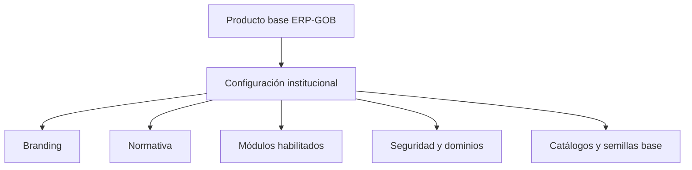
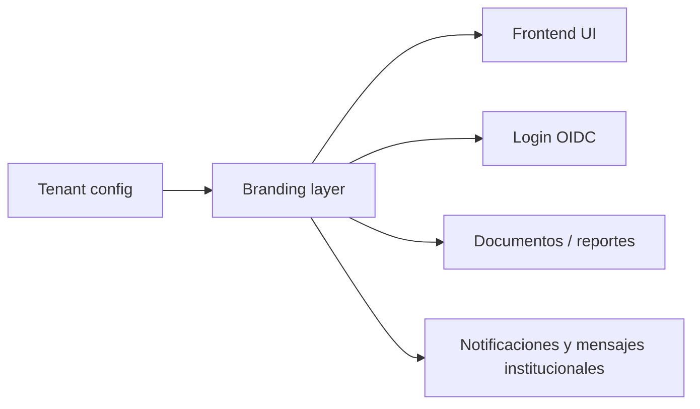
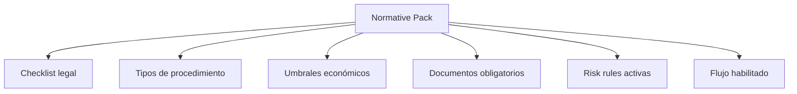
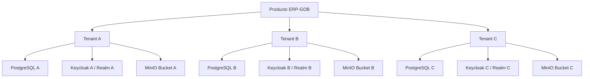
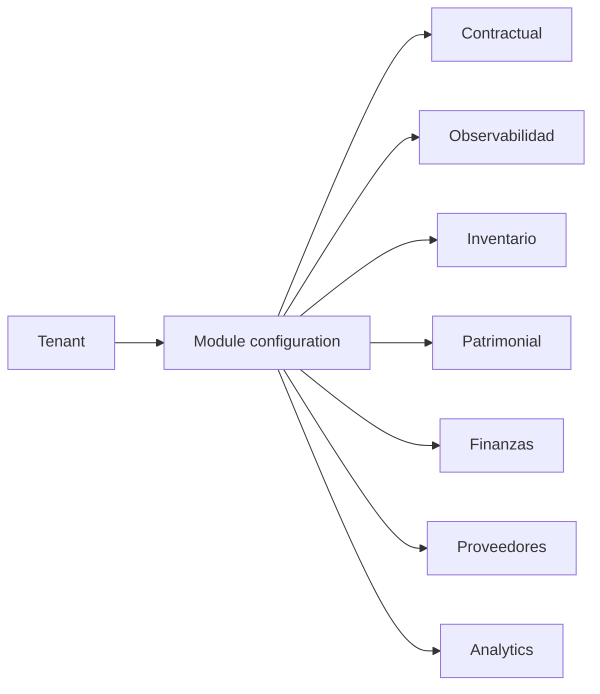
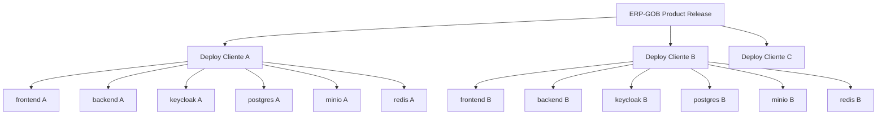

# MULTI_TENANT_ARCHITECTURE_v1

**Producto:** ERP-GOB  
**Propósito del documento:** definir la arquitectura objetivo para convertir ERP-GOB en plataforma multiinstitución vendible a gobiernos estatales.  
**Base alineada con:**
- `docs/architecture/SYSTEM_ARCHITECTURE_v1.11.md`
- `docs/product/PRODUCT_STRATEGY_GOVERNMENT_v1.md`

---

## 1. Objetivo Arquitectónico

ERP-GOB hoy ya funciona como sistema institucional de abastecimiento.  
Para convertirlo en producto vendible, necesita evolucionar de:

- una solución desplegada para un contexto específico,

a:

- una plataforma parametrizable por institución, repetible y operable en múltiples entes públicos.

La arquitectura objetivo debe resolver simultáneamente:
- separación institucional;
- personalización normativa;
- branding por cliente;
- activación selectiva de módulos;
- despliegue controlado por institución;
- operación y soporte escalables.

### Principio rector

La estrategia recomendada no es un SaaS multi-tenant puro desde el día uno.

La estrategia correcta para sector público es:

**una base de producto única con despliegue aislado por cliente y parametrización multi-tenant a nivel de configuración.**

Eso reduce:
- riesgo jurídico;
- complejidad operativa;
- resistencia institucional;
- impacto de incidentes entre clientes.

---

## 2. Tenant Institucional

### 2.1 Definición

Un **tenant institucional** representa una unidad compradora/operadora independiente con:
- identidad propia;
- configuración propia;
- reglas normativas propias;
- usuarios y roles propios;
- documentos propios;
- despliegue propio o espacio aislado.

Ejemplos:
- Gobierno del Estado de X
- Secretaría de Administración de Y
- Universidad Pública Estatal Z
- Organismo descentralizado patrimonialmente autónomo

### 2.2 Atributos mínimos del tenant

| Atributo | Propósito |
|---|---|
| `tenant_code` | identificador técnico estable |
| `tenant_name` | nombre institucional visible |
| `tenant_scope` | estado, dependencia, organismo o municipio |
| `tenant_domain` | dominios públicos del despliegue |
| `tenant_branding` | logos, colores, textos institucionales |
| `tenant_normative_pack` | plantilla normativa aplicada |
| `tenant_modules` | módulos habilitados |
| `tenant_security_profile` | políticas de seguridad específicas |
| `tenant_support_tier` | tipo de soporte y SLA |

### 2.3 Recomendación de implementación

En la primera fase comercial:
- un tenant = un despliegue aislado;
- una institución = una base de datos aislada;
- un tenant = un realm Keycloak o despliegue de identidad aislado.

Esto simplifica:
- cumplimiento;
- debugging;
- backups;
- soporte;
- segregación de datos;
- auditoría contractual.

---

## 3. Configuración Por Institución

La configuración institucional debe separarse del código de producto.

### 3.1 Capas de configuración



### 3.2 Configuraciones que deben parametrizarse

| Componente | Parametrizable |
|---|---|
| UI institucional | nombre, logos, colores, textos |
| Dominios públicos | app, api, auth |
| Identidad | realm, clientes, roles base |
| Catálogos | áreas, clasificaciones, catálogos maestros |
| Workflow | pasos activos, gating, módulos visibles |
| Observabilidad | umbrales, reglas activas, severidades |
| Seguridad | expiraciones, CSRF, políticas de acceso |
| Operación | backups, alertas, rutas de soporte |

### 3.3 Repositorio/config bundle recomendado

Cada cliente debería tener un **bundle institucional**:

```text
tenant-config/
  tenant.json
  branding.json
  normative-pack.json
  modules.json
  seed-base.json
  keycloak/
    realm-template.json
```

Eso permite:
- despliegue repetible;
- auditoría de configuración;
- control de cambios por cliente.

---

## 4. Branding

El branding no es cosmético.  
En sector público, es parte de la adopción institucional.

### 4.1 Elementos de branding

| Elemento | Alcance |
|---|---|
| nombre del sistema | encabezados, login, documentos |
| logotipo | frontend, portal, documentación |
| paleta institucional | UI y reportes |
| pie legal | mensajes institucionales |
| dominios | `erp.estado.gob.mx`, `api.erp.estado.gob.mx`, `auth.erp.estado.gob.mx` |

### 4.2 Diagrama de branding



### 4.3 Recomendación

No incrustar branding por cliente en el código.

Debe resolverse por:
- configuración;
- assets versionados por tenant;
- variables de entorno o configuración cargada al arranque.

---

## 5. Plantillas Normativas

La parametrización normativa es el núcleo del producto multiestado.

### 5.1 Qué debe parametrizarse

| Área normativa | Ejemplos |
|---|---|
| checklist legal | ítems obligatorios por estado |
| tipos de procedimiento | licitación, invitación, adjudicación |
| umbrales económicos | montos máximos por modalidad |
| evidencia obligatoria | documentos por etapa |
| reglas de observabilidad | secuencias inválidas y alertas |
| aprobaciones requeridas | gates jurídicos/financieros |

### 5.2 Modelo de plantilla normativa



### 5.3 Estrategia de packs

| Pack | Uso |
|---|---|
| `federal-base` | referencia genérica base |
| `estado-template` | punto de partida para estado nuevo |
| `estado-especifico` | configuración cerrada por cliente |
| `municipal-lite` | versión simplificada para entes pequeños |

### 5.4 Regla de producto

La plantilla normativa:
- no debe requerir modificar endpoints;
- no debe requerir tocar el dominio base;
- sí puede activar o desactivar validaciones, checklist y umbrales.

---

## 6. Aislamiento De Datos

Este es el punto más sensible del diseño.

### 6.1 Opciones

| Modelo | Ventajas | Riesgos |
|---|---|---|
| Base de datos compartida con `tenant_id` | menor costo de operación | mayor complejidad y riesgo de fuga |
| Schema por tenant | mejor separación lógica | mayor complejidad operativa |
| Base por tenant | máxima separación y mejor argumento institucional | mayor costo infra |

### 6.2 Recomendación ERP-GOB v1

**Base de datos por tenant**  
**Bucket/documentos por tenant**  
**Realm o espacio de identidad aislado por tenant**

Motivos:
- más defendible ante auditoría;
- menor blast radius;
- soporte más claro;
- restauración más simple;
- menos riesgo de acceso cruzado;
- mejor argumento comercial para estados.

### 6.3 Diagrama de aislamiento



### 6.4 Fase futura

Si el producto madura y el mercado exige mayor densidad operativa:
- se puede migrar a tenancy lógica más profunda;
- pero no es la recomendación de entrada para gobierno estatal.

---

## 7. Configuración De Módulos

No todos los clientes van a querer o poder activar todo el producto desde el primer día.

### 7.1 Modelo modular

| Módulo | Estado posible |
|---|---|
| Core contractual | obligatorio |
| Observabilidad | recomendado |
| Inventario operativo | opcional según cliente |
| Patrimonial | opcional |
| Finanzas | opcional según alcance |
| Proveedores compliance | recomendado |
| Analytics | evolutivo |

### 7.2 Diagrama de activación



### 7.3 Efectos de la configuración

La activación de módulos debe impactar:
- navegación frontend;
- paneles visibles;
- reglas del wizard;
- seeds base;
- monitoreo;
- roles cargados por defecto.

### 7.4 Regla de arquitectura

Los módulos no deben depender de `if` desordenados por todo el sistema.

Debe existir una capa clara de `tenant feature flags` o `module configuration`.

---

## 8. Despliegue Aislado Por Cliente

### 8.1 Modelo recomendado de despliegue

Cada cliente debe poder tener:
- su propio entorno;
- su propio dominio;
- su propia configuración;
- su propio backup;
- su propio ciclo de actualización.

### 8.2 Topología sugerida



### 8.3 Beneficios
- aislamiento operativo;
- actualización por cliente;
- rollback por cliente;
- SLA y soporte más claros;
- mayor confianza institucional.

### 8.4 Pipeline deseado


### 8.5 Perfiles de despliegue

| Perfil | Uso |
|---|---|
| `demo` | demostraciones comerciales |
| `piloto` | validación institucional controlada |
| `produccion` | operación formal |

---

## 9. Arquitectura Recomendada De Evolución

### 9.1 Fase 1 — Productización inicial
- despliegue aislado por cliente;
- branding por configuración;
- paquete normativo por estado;
- módulos activables;
- seed institucional por tenant.

### 9.2 Fase 2 — Escalamiento comercial
- instalador automático;
- bundles de configuración por cliente;
- releases por canal (`stable`, `pilot`);
- consola interna de soporte y operación.

### 9.3 Fase 3 — Plataforma madura
- tenancy lógica avanzada donde tenga sentido;
- portal de administración multi-cliente;
- marketplace de plantillas normativas;
- upgrades automatizados y observabilidad central.

---

## 10. Decisiones Arquitectónicas Recomendadas

### Decisión 1
**No empezar con base compartida multi-tenant.**

Justificación:
- riesgo innecesario;
- baja aceptación institucional;
- complejidad alta para soporte.

### Decisión 2
**Separar producto, configuración y normativa.**

Justificación:
- reduce forks por cliente;
- permite mantener un core único.

### Decisión 3
**Resolver la personalización con bundles institucionales.**

Justificación:
- repetibilidad;
- auditoría;
- versionado por cliente.

### Decisión 4
**Mantener despliegue aislado por cliente como estándar comercial.**

Justificación:
- mejor argumento de venta y seguridad;
- menor riesgo reputacional.

---

## 11. Riesgos De Esta Arquitectura

| Riesgo | Mitigación |
|---|---|
| Proliferación de configuraciones por cliente | esquema y validación formal de bundles |
| Divergencia normativa no controlada | catálogo oficial de plantillas y governance de cambios |
| Costos operativos por cliente | automatización de despliegue y soporte |
| Sobrepersonalización | reglas estrictas de producto vs configuración |
| Complejidad de upgrades | versionado compatible de configuración y migraciones |

---

## 12. Conclusión

La arquitectura multi-tenant adecuada para ERP-GOB no es la de un SaaS genérico compartido.

La arquitectura correcta para sector público estatal es:

**producto único + configuración institucional + despliegue aislado por cliente**

con soporte para:
- tenant institucional;
- branding por institución;
- plantillas normativas;
- módulos activables;
- datos aislados;
- operación y soporte repetibles.

Ese modelo convierte ERP-GOB de:
- sistema interno útil,

a:

- plataforma institucional comercializable y escalable para gobiernos estatales.
