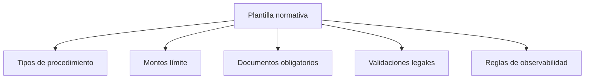
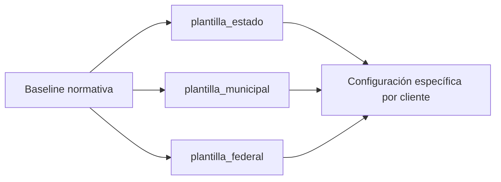

# STATE_NORMATIVE_TEMPLATE_MODEL_v1

**Producto:** ERP-GOB  
**Propósito:** definir el modelo de plantillas normativas para adaptar ERP-GOB a marcos legales estatales y municipales sin modificar el núcleo del producto.  
**Audiencia:** equipos jurídicos, de implantación, arquitectura y producto.

---

## 1. Problema De Variabilidad Normativa

En contratación pública, la operación administrativa comparte principios generales, pero no reglas idénticas.

Cada estado puede variar en:
- tipos de procedimiento permitidos;
- umbrales económicos por modalidad;
- documentos obligatorios;
- requisitos previos de validación;
- secuencias formales entre etapas;
- controles exigidos por contraloría o marco local.

A nivel municipal, la variabilidad puede ser aún mayor por:
- reglamentos internos;
- acuerdos de cabildo;
- manuales administrativos;
- políticas de control propias del ente.

### 1.1 Riesgo de no modelar esta variabilidad

Si el sistema es rígido:
- obliga al cliente a operar “fuera del sistema”;
- provoca bypasses manuales;
- reduce adopción;
- genera conflicto entre norma local y herramienta;
- vuelve inviable vender el producto a más de un estado sin rehacerlo.

### 1.2 Conclusión

ERP-GOB no puede depender de una única lógica legal fija.  
Debe soportar una **capa normativa parametrizable** que permita adaptar el comportamiento institucional sin alterar el producto base.

---

## 2. Concepto De Plantilla Normativa

Una **plantilla normativa** es un paquete de configuración que representa cómo una institución aplica su marco jurídico-administrativo dentro de ERP-GOB.

No es código nuevo.  
No es una bifurcación del sistema.  
Es una capa de configuración institucional.

### 2.1 Qué debe parametrizar una plantilla

| Elemento | Propósito |
|---|---|
| Configuración por estado | aplicar marco legal local |
| Reglas parametrizables | activar o ajustar validaciones y controles |
| Checklist legal configurable | definir requisitos obligatorios |
| Umbrales económicos | establecer límites por modalidad |
| Tipos de procedimiento | habilitar modalidades válidas |

### 2.2 Principio operativo

La plantilla debe poder responder preguntas como:
- ¿qué tipo de procedimiento aplica?
- ¿qué documentos son obligatorios?
- ¿qué checklist debe completarse?
- ¿qué umbral económico cambia la modalidad?
- ¿qué reglas de observabilidad deben estar activas?

---

## 3. Estructura De Plantilla

Cada plantilla normativa debe contener al menos los siguientes bloques.

### 3.1 Tipos de procedimiento

Define qué modalidades están habilitadas para la institución.

Ejemplos:
- compra directa;
- adjudicación directa;
- invitación restringida;
- licitación pública.

### 3.2 Montos límite

Define los umbrales económicos que disparan una modalidad u otra.

Ejemplos:
- hasta cierto monto: compra directa;
- siguiente rango: invitación;
- arriba de cierto límite: licitación.

### 3.3 Documentos obligatorios

Define la evidencia mínima requerida por fase.

Ejemplos:
- investigación de mercado;
- suficiencia presupuestal;
- bases aprobadas;
- convocatoria;
- acta de junta de aclaraciones;
- fallo;
- documento contractual;
- recepción.

### 3.4 Validaciones legales

Define qué prerequisitos deben cumplirse antes de permitir avanzar.

Ejemplos:
- no emitir orden sin checklist completo;
- no registrar recepción sin orden;
- no permitir cierta modalidad si rebasa umbral;
- exigir documento de respaldo en una etapa específica.

### 3.5 Reglas de observabilidad

Define qué controles preventivos deben activarse.

Ejemplos:
- orden antes de checklist;
- recepción antes de orden;
- desviación de precio;
- concentración de proveedor;
- inventario fuera de secuencia.

### 3.6 Estructura conceptual

---

## 4. Ejemplo De Plantillas

Los siguientes ejemplos son conceptuales.  
No sustituyen análisis jurídico del cliente.

### 4.1 `plantilla_federal`

Uso:
- base de referencia;
- demostraciones;
- instituciones que parten de un marco estándar.

Características:
- set básico de checklist legal;
- modalidades generales de contratación;
- observabilidad base;
- evidencias mínimas comunes.

### 4.2 `plantilla_estado`

Uso:
- gobierno estatal con ley propia de adquisiciones;
- poder u organismo con manual armonizado al estado.

Características:
- umbrales propios del estado;
- checklist alineado a ley local;
- documentos específicos exigidos por normativa estatal;
- reglas de control ajustadas a prácticas de contraloría local.

### 4.3 `plantilla_municipal`

Uso:
- municipios grandes;
- organismos operadores;
- entes con reglamentación más simple o más acotada.

Características:
- modalidades reducidas;
- umbrales simplificados;
- menor complejidad documental;
- controles mínimos reforzados por observabilidad.

### 4.4 Relación entre plantillas

---

## 5. Motor De Configuración

ERP-GOB debe aplicar una plantilla normativa como capa de comportamiento institucional.

### 5.1 Qué hace el motor

El motor de configuración debe permitir que el sistema:
- cargue la plantilla activa;
- determine módulos, checklist y reglas vigentes;
- aplique umbrales y validaciones según institución;
- alimente el wizard, el checklist y la observabilidad.

### 5.2 Áreas impactadas por la plantilla

| Componente | Impacto |
|---|---|
| Wizard | pasos visibles, gating y secuencia |
| Checklist legal | ítems requeridos |
| Procedimiento | modalidades permitidas |
| Observabilidad | reglas activas y severidades |
| Documental | tipos de evidencia obligatoria |
| UI institucional | textos y flujos visibles |

### 5.3 Principio de diseño

La plantilla no debe:
- crear endpoints;
- alterar el dominio base;
- cambiar el modelo transaccional.

La plantilla sí debe:
- condicionar comportamiento;
- habilitar o restringir opciones;
- activar controles;
- ajustar validaciones institucionales.

---

## 6. Personalización Por Cliente

La personalización debe lograrse por configuración, no por fork de código.

### 6.1 Qué puede adaptarse sin tocar código

| Elemento | Vía recomendada |
|---|---|
| branding | configuración institucional |
| dominios | variables de entorno / bundle |
| checklist | plantilla normativa |
| tipos de procedimiento | plantilla normativa |
| umbrales | plantilla normativa |
| módulos habilitados | configuración de tenant |
| roles base | plantilla de roles |

### 6.2 Qué no debe hacerse

No debe resolverse por:
- modificar manualmente controladores por cliente;
- duplicar el sistema por estado;
- meter condiciones ad hoc dispersas en frontend y backend;
- crear ramas permanentes por institución.

### 6.3 Regla de producto

Una personalización es aceptable si:
- se expresa en configuración;
- se puede versionar;
- se puede validar;
- no rompe compatibilidad del core.

---

## 7. Gobernanza Normativa

Las leyes cambian.  
Por eso la plantilla no solo debe existir: debe gobernarse.

### 7.1 Responsables

| Rol | Responsabilidad |
|---|---|
| Área jurídica / normativa | definir cambio legal aplicable |
| Producto / implantación | traducirlo a configuración |
| Arquitectura / ingeniería | validar compatibilidad técnica |
| Operación / soporte | calendarizar despliegue y comunicar |

### 7.2 Ciclo de cambio

1. Se identifica cambio normativo.
2. Se analiza impacto funcional.
3. Se actualiza plantilla.
4. Se valida en ambiente de prueba/piloto.
5. Se comunica cambio.
6. Se despliega a producción controlada.

### 7.3 Regla de gobierno

Toda plantilla debe tener:
- versión;
- fecha de vigencia;
- institución destinataria;
- responsable funcional;
- historial de cambios.

---

## 8. Catálogo De Reglas

El sistema debe manejar reglas configurables y comprensibles para equipos legales y técnicos.

### 8.1 Ejemplos de reglas

| Tipo de regla | Ejemplo |
|---|---|
| Umbral de compra directa | monto máximo permitido para modalidad simplificada |
| Documentos obligatorios | requerir investigación y suficiencia presupuestal |
| Validaciones de procedimiento | impedir avanzar si checklist está incompleto |
| Controles de auditoría | activar alerta por orden fuera de secuencia |

### 8.2 Clasificación sugerida

| Categoría | Finalidad |
|---|---|
| Procedimentales | controlar secuencia y modalidad |
| Documentales | exigir evidencia mínima |
| Económicas | aplicar umbrales y montos |
| De control interno | detectar desviaciones y riesgos |
| De observabilidad | alimentar alertas y dashboard |

### 8.3 Relación con observabilidad

Las reglas normativas no solo afectan captura.  
También afectan:
- qué se monitorea;
- qué se considera riesgo;
- qué se muestra como alerta.

---

## 9. Beneficio Para Los Estados

Esta arquitectura es superior a un sistema rígido por varias razones.

### 9.1 Ventajas

| Ventaja | Resultado |
|---|---|
| Adaptabilidad normativa | mismo producto, distintas leyes |
| Menor costo de implantación | no se rehace el sistema por estado |
| Menor riesgo técnico | menos forks y menos deuda |
| Mejor gobierno del cambio | las reglas se versionan |
| Escalabilidad comercial | más estados con una base única |

### 9.2 Beneficio institucional

Para el estado, esto significa:
- adoptar una plataforma sin renunciar a su marco jurídico;
- tener control interno más visible;
- reducir dependencia de desarrollos internos rígidos;
- facilitar auditoría y actualización normativa.

---

## 10. Modelo De Mantenimiento

Las plantillas normativas requieren mantenimiento continuo, pero controlado.

### 10.1 Elementos que se mantienen

- catálogo de plantillas;
- checklist legal;
- umbrales;
- tipos de procedimiento;
- reglas de observabilidad;
- documentos obligatorios.

### 10.2 Modelo recomendado

| Nivel | Mantenimiento |
|---|---|
| Producto base | equipo central de ERP-GOB |
| Plantillas generales | equipo normativo central |
| Ajustes por cliente | implantación + jurídico del cliente |
| Releases de plantillas | ciclo controlado y versionado |

### 10.3 Buenas prácticas

- versionar cada plantilla;
- no modificar reglas en productivo sin control de cambio;
- probar cambios en piloto/staging;
- documentar justificación normativa;
- comunicar fecha de entrada en vigor.

### 10.4 Resultado esperado

El mantenimiento normativo debe convertirse en una operación gobernada, no en una reacción ad hoc a cada cambio legal.

---

## Conclusión

El modelo de plantillas normativas permite que ERP-GOB sea:
- jurídicamente adaptable;
- técnicamente mantenible;
- comercialmente escalable.

Su valor principal es que desacopla:
- el núcleo del producto,

de:

- la variabilidad jurídica de cada estado o municipio.

Eso hace posible vender una sola plataforma con múltiples configuraciones institucionales, sin convertir cada implantación en un desarrollo nuevo.
